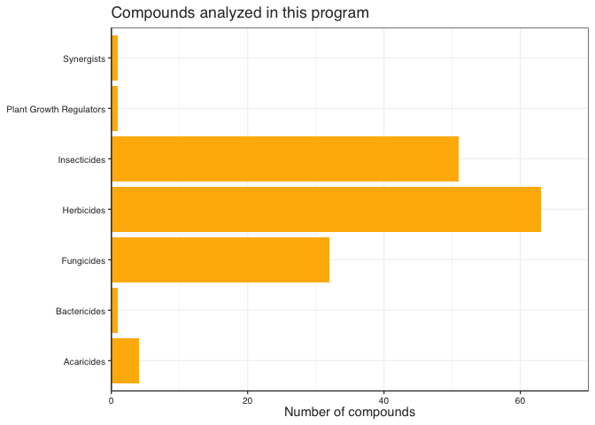
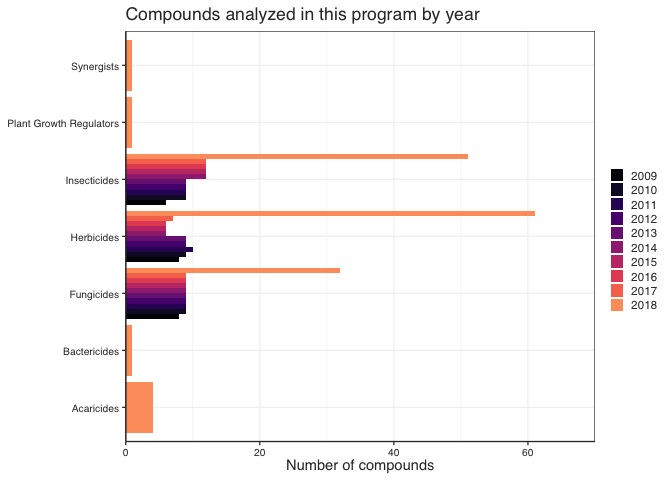

One important part of data exploration is **counting things**, whether this is as a summary variable, or as a check to better understand your data or ensure that the data is the way that you thought it was.

For this class we are going to use a slightly modified version of a [dataset](https://data.princeedwardisland.ca/Environment-and-Food/OD0001-Pesticide-Analysis-for-Stream-Water/jj4n-qqq2) of pesticide sample analyses results for stream water samples for the province of PEI's Pesticide Monitoring Program. The sampling includes a total of 9 rivers across PEI, with at least 3 of the rivers being sampled each year.


```r
pest_original <- read_csv(here("data", "pesticides.csv"))
```

```
## Rows: 6461 Columns: 7
## ── Column specification ────────────────────────────────────────────────────────
## Delimiter: ","
## chr (6): compound, river, date_sampled, result, result_unit, group
## dbl (1): year
## 
## ℹ Use `spec()` to retrieve the full column specification for this data.
## ℹ Specify the column types or set `show_col_types = FALSE` to quiet this message.
```

```r
pest_data <- pest_original %>% 
  clean_names()

print(pest_data)
```

```
## # A tibble: 6,461 × 7
##    compound        river         date_sampled          year result resul…¹ group
##    <chr>           <chr>         <chr>                <dbl> <chr>  <chr>   <chr>
##  1 Azinphos-Methyl Clyde River   06/15/2017 12:00:00…  2017 < 0.03 ng/ml   Inse…
##  2 Methamidophos   Huntley River 10/05/2017 12:00:00…  2017 < 5.0  ng/ml   Inse…
##  3 Metconazole     Dunk River    05/28/2018 12:00:00…  2018 < 0.1… ng/ml   Fung…
##  4 Imidacloprid    Clyde River   07/22/2009 12:00:00…  2009 < 0.1  ng/ml   Inse…
##  5 Dimethoate      Wilmot River  08/13/2015 12:00:00…  2015 < 0.04 ng/ml   Inse…
##  6 Chlorpyrifos    Clyde River   07/25/2018 12:00:00…  2018 < 0.01 ng/ml   Inse…
##  7 Carbofuran      Morell River  07/19/2016 12:00:00…  2016 < 0.02 ng/ml   Inse…
##  8 Azinphos-Methyl Wilmot River  07/26/2017 12:00:00…  2017 < 0.03 ng/ml   Inse…
##  9 Metalaxyl       Mill River    08/24/2017 12:00:00…  2017 < 0.03 ng/ml   Fung…
## 10 Clothianidin    Mill River    08/18/2014 12:00:00…  2014 0.01   ng/ml   Inse…
## # … with 6,451 more rows, and abbreviated variable name ¹​result_unit
```

# Let's answer some questions about the data

## What rivers where sampled

If i wanted to get a list of all the rivers that were sampled each year, I can use `distinct()` which will just give me a list of unique character strings for that variable


```r
pest_data %>% 
  distinct(river)
```

```
## # A tibble: 9 × 1
##   river         
##   <chr>         
## 1 Clyde River   
## 2 Huntley River 
## 3 Dunk River    
## 4 Wilmot River  
## 5 Morell River  
## 6 Mill River    
## 7 Winter River  
## 8 West River    
## 9 Montague River
```

But, how many sites is this? I can just apply `tally()` to this list and it will return the number of elements.


```r
pest_data %>% 
  distinct(river) %>% 
  tally()
```

```
## # A tibble: 1 × 1
##       n
##   <int>
## 1     9
```

## How many rivers were sampled per year

We can list several variables inside `distinct()`. This allows us to request the distinct combinations of those variables, in this case, unique combinations of year and river


```r
 pest_data %>%
  distinct(year, river) 
```

```
## # A tibble: 42 × 2
##    river          year
##    <chr>         <dbl>
##  1 Clyde River    2017
##  2 Huntley River  2017
##  3 Dunk River     2018
##  4 Clyde River    2009
##  5 Wilmot River   2015
##  6 Clyde River    2018
##  7 Morell River   2016
##  8 Wilmot River   2017
##  9 Mill River     2017
## 10 Mill River     2014
## # … with 32 more rows
```


And now we can **tally** them to see how many combinations or river **AND** year were sampled.


```r
 pest_data %>%
  distinct(year, river) %>% 
  tally()
```

```
## # A tibble: 1 × 1
##       n
##   <int>
## 1    42
```

But what if i am interested on **How many rivers were sampled each year?**

We need an extra step!

We can use `group_by()` (which we have used before in the course) to tell R to narrow my tally.


```r
 pest_data %>%
  distinct(year, river) %>% 
  group_by(year) %>% 
  tally()
```

```
## # A tibble: 10 × 2
##     year     n
##    <dbl> <int>
##  1  2009     3
##  2  2010     3
##  3  2011     3
##  4  2012     3
##  5  2013     3
##  6  2014     3
##  7  2015     3
##  8  2016     3
##  9  2017     9
## 10  2018     9
```

Now we are talking! But, there is even an easier option. The function `count()` is a **combination** of `group_by()` and `tally()` all in one step!


```r
 pest_data %>%
  distinct(year, river) %>% 
  count(year) # here year means "by year"
```

```
## # A tibble: 10 × 2
##     year     n
##    <dbl> <int>
##  1  2009     3
##  2  2010     3
##  3  2011     3
##  4  2012     3
##  5  2013     3
##  6  2014     3
##  7  2015     3
##  8  2016     3
##  9  2017     9
## 10  2018     9
```

**NOTE**: It is a bit counter-intuitive, but what goes inside of the `count()` is not the thing you want to count (i don't want to count years, i want to count rivers!) but what **groupings** you want to do for your counting

## What compounds were analysed?

We can do exactly the same for the compounds


```r
pest_data %>% 
  distinct(compound)
```

```
## # A tibble: 153 × 1
##    compound       
##    <chr>          
##  1 Azinphos-Methyl
##  2 Methamidophos  
##  3 Metconazole    
##  4 Imidacloprid   
##  5 Dimethoate     
##  6 Chlorpyrifos   
##  7 Carbofuran     
##  8 Metalaxyl      
##  9 Clothianidin   
## 10 Hexazinone     
## # … with 143 more rows
```

How many compounds is that?


```r
pest_data %>% 
  distinct(compound) %>% 
  tally()
```

```
## # A tibble: 1 × 1
##       n
##   <int>
## 1   153
```

## How many compound of each pesticide group were analysed?

The different pesticides measured belong to different pesticide groups. In order to count how many pesticides of each group were measured, first we make a list of distinct pesticide/group combinations in the dataset with `distinct()` and then we count how many on each group using `count()`  


```r
pest_data %>% 
  distinct(compound, group)
```

```
## # A tibble: 153 × 2
##    compound        group       
##    <chr>           <chr>       
##  1 Azinphos-Methyl Insecticides
##  2 Methamidophos   Insecticides
##  3 Metconazole     Fungicides  
##  4 Imidacloprid    Insecticides
##  5 Dimethoate      Insecticides
##  6 Chlorpyrifos    Insecticides
##  7 Carbofuran      Insecticides
##  8 Metalaxyl       Fungicides  
##  9 Clothianidin    Insecticides
## 10 Hexazinone      Herbicides  
## # … with 143 more rows
```

This is a bit *silly* as a compound can only belong to ne group, but it is a needed intermediate step.


```r
pest_groups <- pest_data %>% 
  distinct(compound, group) %>% 
  count(group)

print(pest_groups)
```

```
## # A tibble: 7 × 2
##   group                       n
##   <chr>                   <int>
## 1 Acaricides                  4
## 2 Bactericides                1
## 3 Fungicides                 32
## 4 Herbicides                 63
## 5 Insecticides               51
## 6 Plant Growth Regulators     1
## 7 Synergists                  1
```


```r
pest_groups %>% 
  ggplot() +
  geom_col(aes(x = n, y = group), fill = "#ffb703") +
  scale_x_continuous(expand = expansion(mult = 0, add = 0)) +
  coord_cartesian(xlim = c(0, 70)) +
  # theme_pepe_full() + (not needed anymore! We have set the theme for the whole file earlier!)
  labs(y = NULL,
       x = "Number of compounds",
       title = "Compounds analyzed in this program")
```

<!-- -->
What if i wanted to know this distribution **per year**?

This one is a bit trickier, but it is just a matter of doing things step by step (thank you pipes!). 

We want to know things also **by year** so now we can just add `year` to our `distinct()`


```r
pest_group_year <- pest_data %>% 
  distinct(year, compound, group) %>%  # distinct combinations of year, compound and group
  count(year, group) # Jut like in group_by() we can ask it to count the combinations of more than one variable

print(pest_group_year)
```

```
## # A tibble: 34 × 3
##     year group            n
##    <dbl> <chr>        <int>
##  1  2009 Fungicides       8
##  2  2009 Herbicides       8
##  3  2009 Insecticides     6
##  4  2010 Fungicides       9
##  5  2010 Herbicides       9
##  6  2010 Insecticides     9
##  7  2011 Fungicides       9
##  8  2011 Herbicides      10
##  9  2011 Insecticides     9
## 10  2012 Fungicides       9
## # … with 24 more rows
```
This allows us to create some nice summary figures


```r
pest_group_year %>% 
  mutate(year = factor(year)) %>% 
  ggplot() +
  geom_col(aes(x = n, y = group, fill = year), position = "dodge") +
  scale_fill_viridis(discrete = TRUE, option = "magma", end = 0.8) +
  scale_x_continuous(expand = expansion(mult = 0, add = 0)) +
  coord_cartesian(xlim = c(0, 70)) +
  # theme_pepe_full() + (not needed anymore! We have set the theme for the whole file earlier!)
  labs(y = NULL,
       x = "Number of compounds",
       title = "Compounds analyzed in this program by year")
```

<!-- -->

# How many samples were collected

One common thing to report is the number of samples that were collected (or considered in an analysis). Calculating the number of samples in this dataset (and many other like it, remember this was taken from a government database) is a bit tricky, because the data is already in **long form**, as such, the *"one sample per row"* does not apply anymore. Now each row is a specific measure of one compound, but a whole panel of compounds were measured for each sample (i.e. each bottle taken of the river). They also do not provide a **Sample_id** variable (taht would be the easiest thing to count!)

However we can still count the number of samples if we get a bit creative.

In this case, a particular sample is each **individual combination of river and date**. I went to a specific river, on a specific date and grabbed a bottle of water, that is a sample. So if i count the number of unique combinations of **date AND river**, then i can count the samples


```r
pest_data %>% 
  distinct(date_sampled, river) %>% 
  tally()
```

```
## # A tibble: 1 × 1
##       n
##   <int>
## 1   192
```

Could we calculate the number of samples collected each year? We sure can!


```r
pest_data %>% 
  distinct(year, date_sampled, river) %>% 
  count(year) # count "by_year"
```

```
## # A tibble: 10 × 2
##     year     n
##    <dbl> <int>
##  1  2009    12
##  2  2010     9
##  3  2011    12
##  4  2012    12
##  5  2013    12
##  6  2014    12
##  7  2015    12
##  8  2016    12
##  9  2017    45
## 10  2018    54
```

# Creating nice summary tables

Let's see what compounds were measured each year:


```r
pest_data %>% 
  distinct(year, compound)
```

```
## # A tibble: 391 × 2
##    compound         year
##    <chr>           <dbl>
##  1 Azinphos-Methyl  2017
##  2 Methamidophos    2017
##  3 Metconazole      2018
##  4 Imidacloprid     2009
##  5 Dimethoate       2015
##  6 Chlorpyrifos     2018
##  7 Carbofuran       2016
##  8 Metalaxyl        2017
##  9 Clothianidin     2014
## 10 Hexazinone       2014
## # … with 381 more rows
```

This is a great format for us to keep on working with the data, but what if i wanted to make it more visually appealing for a paper?

Here is one approach.

Let's start by adding a dummy column of ones, by asking `count()` to count for all the groups:


```r
pest_data %>% 
  distinct(year, compound) %>% 
  count(year, compound)
```

```
## # A tibble: 391 × 3
##     year compound                n
##    <dbl> <chr>               <int>
##  1  2009 Atrazine                1
##  2  2009 Azinphos-Methyl         1
##  3  2009 Azoxystrobin            1
##  4  2009 Carbofuran              1
##  5  2009 Chlorantraniliprole     1
##  6  2009 Chlorothalonil          1
##  7  2009 Dimethoate              1
##  8  2009 Hexazinone              1
##  9  2009 Imidacloprid            1
## 10  2009 Linuron                 1
## # … with 381 more rows
```

Because we are telling it to count by the same variables that we are grouping, obviously the value on **n** is always one

But why did we do this?

Now we can use `pivot_wider()`, telling it to fill the empty combinations (i.e. those that don exist in this dataset) with zeros and we have a nice presence/absence table that we can use for a publication (maybe in the SI)


```r
compoun_year_table <- pest_data %>% 
  distinct(year, compound) %>% 
  count(year, compound) %>% 
  pivot_wider(names_from = year, values_from = n, values_fill = 0)

print(compoun_year_table)
```

```
## # A tibble: 153 × 11
##    compo…¹ `2009` `2010` `2011` `2012` `2013` `2014` `2015` `2016` `2017` `2018`
##    <chr>    <int>  <int>  <int>  <int>  <int>  <int>  <int>  <int>  <int>  <int>
##  1 Atrazi…      1      1      1      1      1      1      1      1      1      1
##  2 Azinph…      1      1      1      1      1      1      1      1      1      1
##  3 Azoxys…      1      1      1      1      1      1      1      1      1      1
##  4 Carbof…      1      1      1      1      1      1      1      1      1      1
##  5 Chlora…      1      1      1      1      1      1      1      1      1      1
##  6 Chloro…      1      1      1      1      1      1      1      1      1      1
##  7 Dimeth…      1      1      1      1      1      1      1      1      1      1
##  8 Hexazi…      1      1      1      1      1      1      1      1      1      1
##  9 Imidac…      1      1      1      1      1      1      1      1      1      1
## 10 Linuron      1      1      1      1      1      1      1      1      1      1
## # … with 143 more rows, and abbreviated variable name ¹​compound
```

# Quick note on some nice tools to make nice-looking tables

By now we have seen how we can save our data frames (or tibbles) into a csv that we can then add to our publications. When we have a chunk of code that generates one of these, RStudio shows us a nice interactive table, but when we knit to `.md` or `html` R only gives us the same output we would get in the console, not very nice, and not even all the data.

There are a number of packages available that help you formating a data frame or tibble into a nice display table. One of them is `{gt}`. 

`{gt}` works a bit like `{ggplot}` but instead of layers of visual data, you can add speciffic instructions for formating a table. You can read more on their [page](https://gt.rstudio.com/index.html).


```r
compoun_year_table %>% 
  gt() %>%      # note that on gt() you add "layers" with a pipe, not a "+" like in ggplot!
   tab_header(
    title = md("**Sampled compounds**"),
    subtitle = str_c("Distribution of sampled compounds between", min(pest_data$year), "&", max(pest_data$year), sep = " ")
  )
```

```{=html}
<div id="bqesgwycah" style="overflow-x:auto;overflow-y:auto;width:auto;height:auto;">
<style>html {
  font-family: -apple-system, BlinkMacSystemFont, 'Segoe UI', Roboto, Oxygen, Ubuntu, Cantarell, 'Helvetica Neue', 'Fira Sans', 'Droid Sans', Arial, sans-serif;
}

#bqesgwycah .gt_table {
  display: table;
  border-collapse: collapse;
  margin-left: auto;
  margin-right: auto;
  color: #333333;
  font-size: 16px;
  font-weight: normal;
  font-style: normal;
  background-color: #FFFFFF;
  width: auto;
  border-top-style: solid;
  border-top-width: 2px;
  border-top-color: #A8A8A8;
  border-right-style: none;
  border-right-width: 2px;
  border-right-color: #D3D3D3;
  border-bottom-style: solid;
  border-bottom-width: 2px;
  border-bottom-color: #A8A8A8;
  border-left-style: none;
  border-left-width: 2px;
  border-left-color: #D3D3D3;
}

#bqesgwycah .gt_heading {
  background-color: #FFFFFF;
  text-align: center;
  border-bottom-color: #FFFFFF;
  border-left-style: none;
  border-left-width: 1px;
  border-left-color: #D3D3D3;
  border-right-style: none;
  border-right-width: 1px;
  border-right-color: #D3D3D3;
}

#bqesgwycah .gt_title {
  color: #333333;
  font-size: 125%;
  font-weight: initial;
  padding-top: 4px;
  padding-bottom: 4px;
  padding-left: 5px;
  padding-right: 5px;
  border-bottom-color: #FFFFFF;
  border-bottom-width: 0;
}

#bqesgwycah .gt_subtitle {
  color: #333333;
  font-size: 85%;
  font-weight: initial;
  padding-top: 0;
  padding-bottom: 6px;
  padding-left: 5px;
  padding-right: 5px;
  border-top-color: #FFFFFF;
  border-top-width: 0;
}

#bqesgwycah .gt_bottom_border {
  border-bottom-style: solid;
  border-bottom-width: 2px;
  border-bottom-color: #D3D3D3;
}

#bqesgwycah .gt_col_headings {
  border-top-style: solid;
  border-top-width: 2px;
  border-top-color: #D3D3D3;
  border-bottom-style: solid;
  border-bottom-width: 2px;
  border-bottom-color: #D3D3D3;
  border-left-style: none;
  border-left-width: 1px;
  border-left-color: #D3D3D3;
  border-right-style: none;
  border-right-width: 1px;
  border-right-color: #D3D3D3;
}

#bqesgwycah .gt_col_heading {
  color: #333333;
  background-color: #FFFFFF;
  font-size: 100%;
  font-weight: normal;
  text-transform: inherit;
  border-left-style: none;
  border-left-width: 1px;
  border-left-color: #D3D3D3;
  border-right-style: none;
  border-right-width: 1px;
  border-right-color: #D3D3D3;
  vertical-align: bottom;
  padding-top: 5px;
  padding-bottom: 6px;
  padding-left: 5px;
  padding-right: 5px;
  overflow-x: hidden;
}

#bqesgwycah .gt_column_spanner_outer {
  color: #333333;
  background-color: #FFFFFF;
  font-size: 100%;
  font-weight: normal;
  text-transform: inherit;
  padding-top: 0;
  padding-bottom: 0;
  padding-left: 4px;
  padding-right: 4px;
}

#bqesgwycah .gt_column_spanner_outer:first-child {
  padding-left: 0;
}

#bqesgwycah .gt_column_spanner_outer:last-child {
  padding-right: 0;
}

#bqesgwycah .gt_column_spanner {
  border-bottom-style: solid;
  border-bottom-width: 2px;
  border-bottom-color: #D3D3D3;
  vertical-align: bottom;
  padding-top: 5px;
  padding-bottom: 5px;
  overflow-x: hidden;
  display: inline-block;
  width: 100%;
}

#bqesgwycah .gt_group_heading {
  padding-top: 8px;
  padding-bottom: 8px;
  padding-left: 5px;
  padding-right: 5px;
  color: #333333;
  background-color: #FFFFFF;
  font-size: 100%;
  font-weight: initial;
  text-transform: inherit;
  border-top-style: solid;
  border-top-width: 2px;
  border-top-color: #D3D3D3;
  border-bottom-style: solid;
  border-bottom-width: 2px;
  border-bottom-color: #D3D3D3;
  border-left-style: none;
  border-left-width: 1px;
  border-left-color: #D3D3D3;
  border-right-style: none;
  border-right-width: 1px;
  border-right-color: #D3D3D3;
  vertical-align: middle;
}

#bqesgwycah .gt_empty_group_heading {
  padding: 0.5px;
  color: #333333;
  background-color: #FFFFFF;
  font-size: 100%;
  font-weight: initial;
  border-top-style: solid;
  border-top-width: 2px;
  border-top-color: #D3D3D3;
  border-bottom-style: solid;
  border-bottom-width: 2px;
  border-bottom-color: #D3D3D3;
  vertical-align: middle;
}

#bqesgwycah .gt_from_md > :first-child {
  margin-top: 0;
}

#bqesgwycah .gt_from_md > :last-child {
  margin-bottom: 0;
}

#bqesgwycah .gt_row {
  padding-top: 8px;
  padding-bottom: 8px;
  padding-left: 5px;
  padding-right: 5px;
  margin: 10px;
  border-top-style: solid;
  border-top-width: 1px;
  border-top-color: #D3D3D3;
  border-left-style: none;
  border-left-width: 1px;
  border-left-color: #D3D3D3;
  border-right-style: none;
  border-right-width: 1px;
  border-right-color: #D3D3D3;
  vertical-align: middle;
  overflow-x: hidden;
}

#bqesgwycah .gt_stub {
  color: #333333;
  background-color: #FFFFFF;
  font-size: 100%;
  font-weight: initial;
  text-transform: inherit;
  border-right-style: solid;
  border-right-width: 2px;
  border-right-color: #D3D3D3;
  padding-left: 5px;
  padding-right: 5px;
}

#bqesgwycah .gt_stub_row_group {
  color: #333333;
  background-color: #FFFFFF;
  font-size: 100%;
  font-weight: initial;
  text-transform: inherit;
  border-right-style: solid;
  border-right-width: 2px;
  border-right-color: #D3D3D3;
  padding-left: 5px;
  padding-right: 5px;
  vertical-align: top;
}

#bqesgwycah .gt_row_group_first td {
  border-top-width: 2px;
}

#bqesgwycah .gt_summary_row {
  color: #333333;
  background-color: #FFFFFF;
  text-transform: inherit;
  padding-top: 8px;
  padding-bottom: 8px;
  padding-left: 5px;
  padding-right: 5px;
}

#bqesgwycah .gt_first_summary_row {
  border-top-style: solid;
  border-top-color: #D3D3D3;
}

#bqesgwycah .gt_first_summary_row.thick {
  border-top-width: 2px;
}

#bqesgwycah .gt_last_summary_row {
  padding-top: 8px;
  padding-bottom: 8px;
  padding-left: 5px;
  padding-right: 5px;
  border-bottom-style: solid;
  border-bottom-width: 2px;
  border-bottom-color: #D3D3D3;
}

#bqesgwycah .gt_grand_summary_row {
  color: #333333;
  background-color: #FFFFFF;
  text-transform: inherit;
  padding-top: 8px;
  padding-bottom: 8px;
  padding-left: 5px;
  padding-right: 5px;
}

#bqesgwycah .gt_first_grand_summary_row {
  padding-top: 8px;
  padding-bottom: 8px;
  padding-left: 5px;
  padding-right: 5px;
  border-top-style: double;
  border-top-width: 6px;
  border-top-color: #D3D3D3;
}

#bqesgwycah .gt_striped {
  background-color: rgba(128, 128, 128, 0.05);
}

#bqesgwycah .gt_table_body {
  border-top-style: solid;
  border-top-width: 2px;
  border-top-color: #D3D3D3;
  border-bottom-style: solid;
  border-bottom-width: 2px;
  border-bottom-color: #D3D3D3;
}

#bqesgwycah .gt_footnotes {
  color: #333333;
  background-color: #FFFFFF;
  border-bottom-style: none;
  border-bottom-width: 2px;
  border-bottom-color: #D3D3D3;
  border-left-style: none;
  border-left-width: 2px;
  border-left-color: #D3D3D3;
  border-right-style: none;
  border-right-width: 2px;
  border-right-color: #D3D3D3;
}

#bqesgwycah .gt_footnote {
  margin: 0px;
  font-size: 90%;
  padding-left: 4px;
  padding-right: 4px;
  padding-left: 5px;
  padding-right: 5px;
}

#bqesgwycah .gt_sourcenotes {
  color: #333333;
  background-color: #FFFFFF;
  border-bottom-style: none;
  border-bottom-width: 2px;
  border-bottom-color: #D3D3D3;
  border-left-style: none;
  border-left-width: 2px;
  border-left-color: #D3D3D3;
  border-right-style: none;
  border-right-width: 2px;
  border-right-color: #D3D3D3;
}

#bqesgwycah .gt_sourcenote {
  font-size: 90%;
  padding-top: 4px;
  padding-bottom: 4px;
  padding-left: 5px;
  padding-right: 5px;
}

#bqesgwycah .gt_left {
  text-align: left;
}

#bqesgwycah .gt_center {
  text-align: center;
}

#bqesgwycah .gt_right {
  text-align: right;
  font-variant-numeric: tabular-nums;
}

#bqesgwycah .gt_font_normal {
  font-weight: normal;
}

#bqesgwycah .gt_font_bold {
  font-weight: bold;
}

#bqesgwycah .gt_font_italic {
  font-style: italic;
}

#bqesgwycah .gt_super {
  font-size: 65%;
}

#bqesgwycah .gt_footnote_marks {
  font-style: italic;
  font-weight: normal;
  font-size: 75%;
  vertical-align: 0.4em;
}

#bqesgwycah .gt_asterisk {
  font-size: 100%;
  vertical-align: 0;
}

#bqesgwycah .gt_indent_1 {
  text-indent: 5px;
}

#bqesgwycah .gt_indent_2 {
  text-indent: 10px;
}

#bqesgwycah .gt_indent_3 {
  text-indent: 15px;
}

#bqesgwycah .gt_indent_4 {
  text-indent: 20px;
}

#bqesgwycah .gt_indent_5 {
  text-indent: 25px;
}
</style>
<table class="gt_table">
  <thead class="gt_header">
    <tr>
      <td colspan="11" class="gt_heading gt_title gt_font_normal" style><strong>Sampled compounds</strong></td>
    </tr>
    <tr>
      <td colspan="11" class="gt_heading gt_subtitle gt_font_normal gt_bottom_border" style>Distribution of sampled compounds between 2009 &amp; 2018</td>
    </tr>
  </thead>
  <thead class="gt_col_headings">
    <tr>
      <th class="gt_col_heading gt_columns_bottom_border gt_left" rowspan="1" colspan="1" scope="col">compound</th>
      <th class="gt_col_heading gt_columns_bottom_border gt_right" rowspan="1" colspan="1" scope="col">2009</th>
      <th class="gt_col_heading gt_columns_bottom_border gt_right" rowspan="1" colspan="1" scope="col">2010</th>
      <th class="gt_col_heading gt_columns_bottom_border gt_right" rowspan="1" colspan="1" scope="col">2011</th>
      <th class="gt_col_heading gt_columns_bottom_border gt_right" rowspan="1" colspan="1" scope="col">2012</th>
      <th class="gt_col_heading gt_columns_bottom_border gt_right" rowspan="1" colspan="1" scope="col">2013</th>
      <th class="gt_col_heading gt_columns_bottom_border gt_right" rowspan="1" colspan="1" scope="col">2014</th>
      <th class="gt_col_heading gt_columns_bottom_border gt_right" rowspan="1" colspan="1" scope="col">2015</th>
      <th class="gt_col_heading gt_columns_bottom_border gt_right" rowspan="1" colspan="1" scope="col">2016</th>
      <th class="gt_col_heading gt_columns_bottom_border gt_right" rowspan="1" colspan="1" scope="col">2017</th>
      <th class="gt_col_heading gt_columns_bottom_border gt_right" rowspan="1" colspan="1" scope="col">2018</th>
    </tr>
  </thead>
  <tbody class="gt_table_body">
    <tr><td class="gt_row gt_left">Atrazine</td>
<td class="gt_row gt_right">1</td>
<td class="gt_row gt_right">1</td>
<td class="gt_row gt_right">1</td>
<td class="gt_row gt_right">1</td>
<td class="gt_row gt_right">1</td>
<td class="gt_row gt_right">1</td>
<td class="gt_row gt_right">1</td>
<td class="gt_row gt_right">1</td>
<td class="gt_row gt_right">1</td>
<td class="gt_row gt_right">1</td></tr>
    <tr><td class="gt_row gt_left">Azinphos-Methyl</td>
<td class="gt_row gt_right">1</td>
<td class="gt_row gt_right">1</td>
<td class="gt_row gt_right">1</td>
<td class="gt_row gt_right">1</td>
<td class="gt_row gt_right">1</td>
<td class="gt_row gt_right">1</td>
<td class="gt_row gt_right">1</td>
<td class="gt_row gt_right">1</td>
<td class="gt_row gt_right">1</td>
<td class="gt_row gt_right">1</td></tr>
    <tr><td class="gt_row gt_left">Azoxystrobin</td>
<td class="gt_row gt_right">1</td>
<td class="gt_row gt_right">1</td>
<td class="gt_row gt_right">1</td>
<td class="gt_row gt_right">1</td>
<td class="gt_row gt_right">1</td>
<td class="gt_row gt_right">1</td>
<td class="gt_row gt_right">1</td>
<td class="gt_row gt_right">1</td>
<td class="gt_row gt_right">1</td>
<td class="gt_row gt_right">1</td></tr>
    <tr><td class="gt_row gt_left">Carbofuran</td>
<td class="gt_row gt_right">1</td>
<td class="gt_row gt_right">1</td>
<td class="gt_row gt_right">1</td>
<td class="gt_row gt_right">1</td>
<td class="gt_row gt_right">1</td>
<td class="gt_row gt_right">1</td>
<td class="gt_row gt_right">1</td>
<td class="gt_row gt_right">1</td>
<td class="gt_row gt_right">1</td>
<td class="gt_row gt_right">1</td></tr>
    <tr><td class="gt_row gt_left">Chlorantraniliprole</td>
<td class="gt_row gt_right">1</td>
<td class="gt_row gt_right">1</td>
<td class="gt_row gt_right">1</td>
<td class="gt_row gt_right">1</td>
<td class="gt_row gt_right">1</td>
<td class="gt_row gt_right">1</td>
<td class="gt_row gt_right">1</td>
<td class="gt_row gt_right">1</td>
<td class="gt_row gt_right">1</td>
<td class="gt_row gt_right">1</td></tr>
    <tr><td class="gt_row gt_left">Chlorothalonil</td>
<td class="gt_row gt_right">1</td>
<td class="gt_row gt_right">1</td>
<td class="gt_row gt_right">1</td>
<td class="gt_row gt_right">1</td>
<td class="gt_row gt_right">1</td>
<td class="gt_row gt_right">1</td>
<td class="gt_row gt_right">1</td>
<td class="gt_row gt_right">1</td>
<td class="gt_row gt_right">1</td>
<td class="gt_row gt_right">1</td></tr>
    <tr><td class="gt_row gt_left">Dimethoate</td>
<td class="gt_row gt_right">1</td>
<td class="gt_row gt_right">1</td>
<td class="gt_row gt_right">1</td>
<td class="gt_row gt_right">1</td>
<td class="gt_row gt_right">1</td>
<td class="gt_row gt_right">1</td>
<td class="gt_row gt_right">1</td>
<td class="gt_row gt_right">1</td>
<td class="gt_row gt_right">1</td>
<td class="gt_row gt_right">1</td></tr>
    <tr><td class="gt_row gt_left">Hexazinone</td>
<td class="gt_row gt_right">1</td>
<td class="gt_row gt_right">1</td>
<td class="gt_row gt_right">1</td>
<td class="gt_row gt_right">1</td>
<td class="gt_row gt_right">1</td>
<td class="gt_row gt_right">1</td>
<td class="gt_row gt_right">1</td>
<td class="gt_row gt_right">1</td>
<td class="gt_row gt_right">1</td>
<td class="gt_row gt_right">1</td></tr>
    <tr><td class="gt_row gt_left">Imidacloprid</td>
<td class="gt_row gt_right">1</td>
<td class="gt_row gt_right">1</td>
<td class="gt_row gt_right">1</td>
<td class="gt_row gt_right">1</td>
<td class="gt_row gt_right">1</td>
<td class="gt_row gt_right">1</td>
<td class="gt_row gt_right">1</td>
<td class="gt_row gt_right">1</td>
<td class="gt_row gt_right">1</td>
<td class="gt_row gt_right">1</td></tr>
    <tr><td class="gt_row gt_left">Linuron</td>
<td class="gt_row gt_right">1</td>
<td class="gt_row gt_right">1</td>
<td class="gt_row gt_right">1</td>
<td class="gt_row gt_right">1</td>
<td class="gt_row gt_right">1</td>
<td class="gt_row gt_right">1</td>
<td class="gt_row gt_right">1</td>
<td class="gt_row gt_right">1</td>
<td class="gt_row gt_right">1</td>
<td class="gt_row gt_right">1</td></tr>
    <tr><td class="gt_row gt_left">Mancozeb</td>
<td class="gt_row gt_right">1</td>
<td class="gt_row gt_right">1</td>
<td class="gt_row gt_right">1</td>
<td class="gt_row gt_right">1</td>
<td class="gt_row gt_right">1</td>
<td class="gt_row gt_right">1</td>
<td class="gt_row gt_right">1</td>
<td class="gt_row gt_right">1</td>
<td class="gt_row gt_right">1</td>
<td class="gt_row gt_right">1</td></tr>
    <tr><td class="gt_row gt_left">Mcpa</td>
<td class="gt_row gt_right">1</td>
<td class="gt_row gt_right">1</td>
<td class="gt_row gt_right">1</td>
<td class="gt_row gt_right">1</td>
<td class="gt_row gt_right">1</td>
<td class="gt_row gt_right">0</td>
<td class="gt_row gt_right">0</td>
<td class="gt_row gt_right">0</td>
<td class="gt_row gt_right">0</td>
<td class="gt_row gt_right">1</td></tr>
    <tr><td class="gt_row gt_left">Metalaxyl</td>
<td class="gt_row gt_right">1</td>
<td class="gt_row gt_right">1</td>
<td class="gt_row gt_right">1</td>
<td class="gt_row gt_right">1</td>
<td class="gt_row gt_right">1</td>
<td class="gt_row gt_right">1</td>
<td class="gt_row gt_right">1</td>
<td class="gt_row gt_right">1</td>
<td class="gt_row gt_right">1</td>
<td class="gt_row gt_right">1</td></tr>
    <tr><td class="gt_row gt_left">Methamidophos</td>
<td class="gt_row gt_right">1</td>
<td class="gt_row gt_right">1</td>
<td class="gt_row gt_right">1</td>
<td class="gt_row gt_right">1</td>
<td class="gt_row gt_right">1</td>
<td class="gt_row gt_right">1</td>
<td class="gt_row gt_right">1</td>
<td class="gt_row gt_right">1</td>
<td class="gt_row gt_right">1</td>
<td class="gt_row gt_right">1</td></tr>
    <tr><td class="gt_row gt_left">Metiram</td>
<td class="gt_row gt_right">1</td>
<td class="gt_row gt_right">1</td>
<td class="gt_row gt_right">1</td>
<td class="gt_row gt_right">1</td>
<td class="gt_row gt_right">1</td>
<td class="gt_row gt_right">1</td>
<td class="gt_row gt_right">1</td>
<td class="gt_row gt_right">1</td>
<td class="gt_row gt_right">1</td>
<td class="gt_row gt_right">1</td></tr>
    <tr><td class="gt_row gt_left">Metobromuron</td>
<td class="gt_row gt_right">1</td>
<td class="gt_row gt_right">1</td>
<td class="gt_row gt_right">1</td>
<td class="gt_row gt_right">1</td>
<td class="gt_row gt_right">1</td>
<td class="gt_row gt_right">1</td>
<td class="gt_row gt_right">1</td>
<td class="gt_row gt_right">1</td>
<td class="gt_row gt_right">1</td>
<td class="gt_row gt_right">1</td></tr>
    <tr><td class="gt_row gt_left">Metribuzin</td>
<td class="gt_row gt_right">1</td>
<td class="gt_row gt_right">1</td>
<td class="gt_row gt_right">1</td>
<td class="gt_row gt_right">1</td>
<td class="gt_row gt_right">1</td>
<td class="gt_row gt_right">1</td>
<td class="gt_row gt_right">1</td>
<td class="gt_row gt_right">1</td>
<td class="gt_row gt_right">1</td>
<td class="gt_row gt_right">1</td></tr>
    <tr><td class="gt_row gt_left">Paraquat</td>
<td class="gt_row gt_right">1</td>
<td class="gt_row gt_right">1</td>
<td class="gt_row gt_right">1</td>
<td class="gt_row gt_right">1</td>
<td class="gt_row gt_right">1</td>
<td class="gt_row gt_right">0</td>
<td class="gt_row gt_right">0</td>
<td class="gt_row gt_right">0</td>
<td class="gt_row gt_right">0</td>
<td class="gt_row gt_right">0</td></tr>
    <tr><td class="gt_row gt_left">Propiconazole</td>
<td class="gt_row gt_right">1</td>
<td class="gt_row gt_right">1</td>
<td class="gt_row gt_right">1</td>
<td class="gt_row gt_right">1</td>
<td class="gt_row gt_right">1</td>
<td class="gt_row gt_right">1</td>
<td class="gt_row gt_right">1</td>
<td class="gt_row gt_right">1</td>
<td class="gt_row gt_right">1</td>
<td class="gt_row gt_right">1</td></tr>
    <tr><td class="gt_row gt_left">Rimsulfuron</td>
<td class="gt_row gt_right">1</td>
<td class="gt_row gt_right">1</td>
<td class="gt_row gt_right">1</td>
<td class="gt_row gt_right">1</td>
<td class="gt_row gt_right">1</td>
<td class="gt_row gt_right">1</td>
<td class="gt_row gt_right">1</td>
<td class="gt_row gt_right">1</td>
<td class="gt_row gt_right">1</td>
<td class="gt_row gt_right">1</td></tr>
    <tr><td class="gt_row gt_left">Thiabendazole</td>
<td class="gt_row gt_right">1</td>
<td class="gt_row gt_right">1</td>
<td class="gt_row gt_right">1</td>
<td class="gt_row gt_right">1</td>
<td class="gt_row gt_right">1</td>
<td class="gt_row gt_right">1</td>
<td class="gt_row gt_right">1</td>
<td class="gt_row gt_right">1</td>
<td class="gt_row gt_right">1</td>
<td class="gt_row gt_right">1</td></tr>
    <tr><td class="gt_row gt_left">Thiophanate-Methyl</td>
<td class="gt_row gt_right">1</td>
<td class="gt_row gt_right">1</td>
<td class="gt_row gt_right">1</td>
<td class="gt_row gt_right">1</td>
<td class="gt_row gt_right">1</td>
<td class="gt_row gt_right">1</td>
<td class="gt_row gt_right">1</td>
<td class="gt_row gt_right">1</td>
<td class="gt_row gt_right">1</td>
<td class="gt_row gt_right">1</td></tr>
    <tr><td class="gt_row gt_left">Clothianidin</td>
<td class="gt_row gt_right">0</td>
<td class="gt_row gt_right">1</td>
<td class="gt_row gt_right">1</td>
<td class="gt_row gt_right">1</td>
<td class="gt_row gt_right">1</td>
<td class="gt_row gt_right">1</td>
<td class="gt_row gt_right">1</td>
<td class="gt_row gt_right">1</td>
<td class="gt_row gt_right">1</td>
<td class="gt_row gt_right">1</td></tr>
    <tr><td class="gt_row gt_left">Diquat</td>
<td class="gt_row gt_right">0</td>
<td class="gt_row gt_right">1</td>
<td class="gt_row gt_right">1</td>
<td class="gt_row gt_right">1</td>
<td class="gt_row gt_right">1</td>
<td class="gt_row gt_right">0</td>
<td class="gt_row gt_right">0</td>
<td class="gt_row gt_right">0</td>
<td class="gt_row gt_right">0</td>
<td class="gt_row gt_right">0</td></tr>
    <tr><td class="gt_row gt_left">Fludioxonil</td>
<td class="gt_row gt_right">0</td>
<td class="gt_row gt_right">1</td>
<td class="gt_row gt_right">1</td>
<td class="gt_row gt_right">1</td>
<td class="gt_row gt_right">1</td>
<td class="gt_row gt_right">1</td>
<td class="gt_row gt_right">1</td>
<td class="gt_row gt_right">1</td>
<td class="gt_row gt_right">1</td>
<td class="gt_row gt_right">1</td></tr>
    <tr><td class="gt_row gt_left">Phorate</td>
<td class="gt_row gt_right">0</td>
<td class="gt_row gt_right">1</td>
<td class="gt_row gt_right">1</td>
<td class="gt_row gt_right">1</td>
<td class="gt_row gt_right">1</td>
<td class="gt_row gt_right">1</td>
<td class="gt_row gt_right">1</td>
<td class="gt_row gt_right">1</td>
<td class="gt_row gt_right">1</td>
<td class="gt_row gt_right">1</td></tr>
    <tr><td class="gt_row gt_left">Thiamethoxam</td>
<td class="gt_row gt_right">0</td>
<td class="gt_row gt_right">1</td>
<td class="gt_row gt_right">1</td>
<td class="gt_row gt_right">1</td>
<td class="gt_row gt_right">1</td>
<td class="gt_row gt_right">1</td>
<td class="gt_row gt_right">1</td>
<td class="gt_row gt_right">1</td>
<td class="gt_row gt_right">1</td>
<td class="gt_row gt_right">1</td></tr>
    <tr><td class="gt_row gt_left">Glyphosate</td>
<td class="gt_row gt_right">0</td>
<td class="gt_row gt_right">0</td>
<td class="gt_row gt_right">1</td>
<td class="gt_row gt_right">0</td>
<td class="gt_row gt_right">0</td>
<td class="gt_row gt_right">0</td>
<td class="gt_row gt_right">0</td>
<td class="gt_row gt_right">0</td>
<td class="gt_row gt_right">0</td>
<td class="gt_row gt_right">1</td></tr>
    <tr><td class="gt_row gt_left">Chlorpyrifos</td>
<td class="gt_row gt_right">0</td>
<td class="gt_row gt_right">0</td>
<td class="gt_row gt_right">0</td>
<td class="gt_row gt_right">0</td>
<td class="gt_row gt_right">0</td>
<td class="gt_row gt_right">1</td>
<td class="gt_row gt_right">1</td>
<td class="gt_row gt_right">1</td>
<td class="gt_row gt_right">1</td>
<td class="gt_row gt_right">1</td></tr>
    <tr><td class="gt_row gt_left">Cypermethrin</td>
<td class="gt_row gt_right">0</td>
<td class="gt_row gt_right">0</td>
<td class="gt_row gt_right">0</td>
<td class="gt_row gt_right">0</td>
<td class="gt_row gt_right">0</td>
<td class="gt_row gt_right">1</td>
<td class="gt_row gt_right">1</td>
<td class="gt_row gt_right">1</td>
<td class="gt_row gt_right">1</td>
<td class="gt_row gt_right">1</td></tr>
    <tr><td class="gt_row gt_left">Permethrin</td>
<td class="gt_row gt_right">0</td>
<td class="gt_row gt_right">0</td>
<td class="gt_row gt_right">0</td>
<td class="gt_row gt_right">0</td>
<td class="gt_row gt_right">0</td>
<td class="gt_row gt_right">1</td>
<td class="gt_row gt_right">1</td>
<td class="gt_row gt_right">1</td>
<td class="gt_row gt_right">1</td>
<td class="gt_row gt_right">1</td></tr>
    <tr><td class="gt_row gt_left">Terbacil</td>
<td class="gt_row gt_right">0</td>
<td class="gt_row gt_right">0</td>
<td class="gt_row gt_right">0</td>
<td class="gt_row gt_right">0</td>
<td class="gt_row gt_right">0</td>
<td class="gt_row gt_right">0</td>
<td class="gt_row gt_right">0</td>
<td class="gt_row gt_right">0</td>
<td class="gt_row gt_right">1</td>
<td class="gt_row gt_right">1</td></tr>
    <tr><td class="gt_row gt_left">Acetamiprid</td>
<td class="gt_row gt_right">0</td>
<td class="gt_row gt_right">0</td>
<td class="gt_row gt_right">0</td>
<td class="gt_row gt_right">0</td>
<td class="gt_row gt_right">0</td>
<td class="gt_row gt_right">0</td>
<td class="gt_row gt_right">0</td>
<td class="gt_row gt_right">0</td>
<td class="gt_row gt_right">0</td>
<td class="gt_row gt_right">1</td></tr>
    <tr><td class="gt_row gt_left">Alachlor</td>
<td class="gt_row gt_right">0</td>
<td class="gt_row gt_right">0</td>
<td class="gt_row gt_right">0</td>
<td class="gt_row gt_right">0</td>
<td class="gt_row gt_right">0</td>
<td class="gt_row gt_right">0</td>
<td class="gt_row gt_right">0</td>
<td class="gt_row gt_right">0</td>
<td class="gt_row gt_right">0</td>
<td class="gt_row gt_right">1</td></tr>
    <tr><td class="gt_row gt_left">Aldrin</td>
<td class="gt_row gt_right">0</td>
<td class="gt_row gt_right">0</td>
<td class="gt_row gt_right">0</td>
<td class="gt_row gt_right">0</td>
<td class="gt_row gt_right">0</td>
<td class="gt_row gt_right">0</td>
<td class="gt_row gt_right">0</td>
<td class="gt_row gt_right">0</td>
<td class="gt_row gt_right">0</td>
<td class="gt_row gt_right">1</td></tr>
    <tr><td class="gt_row gt_left">Allidochlor</td>
<td class="gt_row gt_right">0</td>
<td class="gt_row gt_right">0</td>
<td class="gt_row gt_right">0</td>
<td class="gt_row gt_right">0</td>
<td class="gt_row gt_right">0</td>
<td class="gt_row gt_right">0</td>
<td class="gt_row gt_right">0</td>
<td class="gt_row gt_right">0</td>
<td class="gt_row gt_right">0</td>
<td class="gt_row gt_right">1</td></tr>
    <tr><td class="gt_row gt_left">Ampa</td>
<td class="gt_row gt_right">0</td>
<td class="gt_row gt_right">0</td>
<td class="gt_row gt_right">0</td>
<td class="gt_row gt_right">0</td>
<td class="gt_row gt_right">0</td>
<td class="gt_row gt_right">0</td>
<td class="gt_row gt_right">0</td>
<td class="gt_row gt_right">0</td>
<td class="gt_row gt_right">0</td>
<td class="gt_row gt_right">1</td></tr>
    <tr><td class="gt_row gt_left">Benalaxyl</td>
<td class="gt_row gt_right">0</td>
<td class="gt_row gt_right">0</td>
<td class="gt_row gt_right">0</td>
<td class="gt_row gt_right">0</td>
<td class="gt_row gt_right">0</td>
<td class="gt_row gt_right">0</td>
<td class="gt_row gt_right">0</td>
<td class="gt_row gt_right">0</td>
<td class="gt_row gt_right">0</td>
<td class="gt_row gt_right">1</td></tr>
    <tr><td class="gt_row gt_left">Benfluralin</td>
<td class="gt_row gt_right">0</td>
<td class="gt_row gt_right">0</td>
<td class="gt_row gt_right">0</td>
<td class="gt_row gt_right">0</td>
<td class="gt_row gt_right">0</td>
<td class="gt_row gt_right">0</td>
<td class="gt_row gt_right">0</td>
<td class="gt_row gt_right">0</td>
<td class="gt_row gt_right">0</td>
<td class="gt_row gt_right">1</td></tr>
    <tr><td class="gt_row gt_left">Benzoylprop-Ethyl</td>
<td class="gt_row gt_right">0</td>
<td class="gt_row gt_right">0</td>
<td class="gt_row gt_right">0</td>
<td class="gt_row gt_right">0</td>
<td class="gt_row gt_right">0</td>
<td class="gt_row gt_right">0</td>
<td class="gt_row gt_right">0</td>
<td class="gt_row gt_right">0</td>
<td class="gt_row gt_right">0</td>
<td class="gt_row gt_right">1</td></tr>
    <tr><td class="gt_row gt_left">Bifenazate</td>
<td class="gt_row gt_right">0</td>
<td class="gt_row gt_right">0</td>
<td class="gt_row gt_right">0</td>
<td class="gt_row gt_right">0</td>
<td class="gt_row gt_right">0</td>
<td class="gt_row gt_right">0</td>
<td class="gt_row gt_right">0</td>
<td class="gt_row gt_right">0</td>
<td class="gt_row gt_right">0</td>
<td class="gt_row gt_right">1</td></tr>
    <tr><td class="gt_row gt_left">Bifenthrin</td>
<td class="gt_row gt_right">0</td>
<td class="gt_row gt_right">0</td>
<td class="gt_row gt_right">0</td>
<td class="gt_row gt_right">0</td>
<td class="gt_row gt_right">0</td>
<td class="gt_row gt_right">0</td>
<td class="gt_row gt_right">0</td>
<td class="gt_row gt_right">0</td>
<td class="gt_row gt_right">0</td>
<td class="gt_row gt_right">1</td></tr>
    <tr><td class="gt_row gt_left">Boscalid</td>
<td class="gt_row gt_right">0</td>
<td class="gt_row gt_right">0</td>
<td class="gt_row gt_right">0</td>
<td class="gt_row gt_right">0</td>
<td class="gt_row gt_right">0</td>
<td class="gt_row gt_right">0</td>
<td class="gt_row gt_right">0</td>
<td class="gt_row gt_right">0</td>
<td class="gt_row gt_right">0</td>
<td class="gt_row gt_right">1</td></tr>
    <tr><td class="gt_row gt_left">Bromacil</td>
<td class="gt_row gt_right">0</td>
<td class="gt_row gt_right">0</td>
<td class="gt_row gt_right">0</td>
<td class="gt_row gt_right">0</td>
<td class="gt_row gt_right">0</td>
<td class="gt_row gt_right">0</td>
<td class="gt_row gt_right">0</td>
<td class="gt_row gt_right">0</td>
<td class="gt_row gt_right">0</td>
<td class="gt_row gt_right">1</td></tr>
    <tr><td class="gt_row gt_left">Bromophos-Ethyl</td>
<td class="gt_row gt_right">0</td>
<td class="gt_row gt_right">0</td>
<td class="gt_row gt_right">0</td>
<td class="gt_row gt_right">0</td>
<td class="gt_row gt_right">0</td>
<td class="gt_row gt_right">0</td>
<td class="gt_row gt_right">0</td>
<td class="gt_row gt_right">0</td>
<td class="gt_row gt_right">0</td>
<td class="gt_row gt_right">1</td></tr>
    <tr><td class="gt_row gt_left">Bromopropylate</td>
<td class="gt_row gt_right">0</td>
<td class="gt_row gt_right">0</td>
<td class="gt_row gt_right">0</td>
<td class="gt_row gt_right">0</td>
<td class="gt_row gt_right">0</td>
<td class="gt_row gt_right">0</td>
<td class="gt_row gt_right">0</td>
<td class="gt_row gt_right">0</td>
<td class="gt_row gt_right">0</td>
<td class="gt_row gt_right">1</td></tr>
    <tr><td class="gt_row gt_left">Bromoxynil</td>
<td class="gt_row gt_right">0</td>
<td class="gt_row gt_right">0</td>
<td class="gt_row gt_right">0</td>
<td class="gt_row gt_right">0</td>
<td class="gt_row gt_right">0</td>
<td class="gt_row gt_right">0</td>
<td class="gt_row gt_right">0</td>
<td class="gt_row gt_right">0</td>
<td class="gt_row gt_right">0</td>
<td class="gt_row gt_right">1</td></tr>
    <tr><td class="gt_row gt_left">Bupirimate</td>
<td class="gt_row gt_right">0</td>
<td class="gt_row gt_right">0</td>
<td class="gt_row gt_right">0</td>
<td class="gt_row gt_right">0</td>
<td class="gt_row gt_right">0</td>
<td class="gt_row gt_right">0</td>
<td class="gt_row gt_right">0</td>
<td class="gt_row gt_right">0</td>
<td class="gt_row gt_right">0</td>
<td class="gt_row gt_right">1</td></tr>
    <tr><td class="gt_row gt_left">Butachlor</td>
<td class="gt_row gt_right">0</td>
<td class="gt_row gt_right">0</td>
<td class="gt_row gt_right">0</td>
<td class="gt_row gt_right">0</td>
<td class="gt_row gt_right">0</td>
<td class="gt_row gt_right">0</td>
<td class="gt_row gt_right">0</td>
<td class="gt_row gt_right">0</td>
<td class="gt_row gt_right">0</td>
<td class="gt_row gt_right">1</td></tr>
    <tr><td class="gt_row gt_left">Butralin</td>
<td class="gt_row gt_right">0</td>
<td class="gt_row gt_right">0</td>
<td class="gt_row gt_right">0</td>
<td class="gt_row gt_right">0</td>
<td class="gt_row gt_right">0</td>
<td class="gt_row gt_right">0</td>
<td class="gt_row gt_right">0</td>
<td class="gt_row gt_right">0</td>
<td class="gt_row gt_right">0</td>
<td class="gt_row gt_right">1</td></tr>
    <tr><td class="gt_row gt_left">Butylate</td>
<td class="gt_row gt_right">0</td>
<td class="gt_row gt_right">0</td>
<td class="gt_row gt_right">0</td>
<td class="gt_row gt_right">0</td>
<td class="gt_row gt_right">0</td>
<td class="gt_row gt_right">0</td>
<td class="gt_row gt_right">0</td>
<td class="gt_row gt_right">0</td>
<td class="gt_row gt_right">0</td>
<td class="gt_row gt_right">1</td></tr>
    <tr><td class="gt_row gt_left">Captan</td>
<td class="gt_row gt_right">0</td>
<td class="gt_row gt_right">0</td>
<td class="gt_row gt_right">0</td>
<td class="gt_row gt_right">0</td>
<td class="gt_row gt_right">0</td>
<td class="gt_row gt_right">0</td>
<td class="gt_row gt_right">0</td>
<td class="gt_row gt_right">0</td>
<td class="gt_row gt_right">0</td>
<td class="gt_row gt_right">1</td></tr>
    <tr><td class="gt_row gt_left">Carbaryl</td>
<td class="gt_row gt_right">0</td>
<td class="gt_row gt_right">0</td>
<td class="gt_row gt_right">0</td>
<td class="gt_row gt_right">0</td>
<td class="gt_row gt_right">0</td>
<td class="gt_row gt_right">0</td>
<td class="gt_row gt_right">0</td>
<td class="gt_row gt_right">0</td>
<td class="gt_row gt_right">0</td>
<td class="gt_row gt_right">1</td></tr>
    <tr><td class="gt_row gt_left">Carfentrazone-Ethyl</td>
<td class="gt_row gt_right">0</td>
<td class="gt_row gt_right">0</td>
<td class="gt_row gt_right">0</td>
<td class="gt_row gt_right">0</td>
<td class="gt_row gt_right">0</td>
<td class="gt_row gt_right">0</td>
<td class="gt_row gt_right">0</td>
<td class="gt_row gt_right">0</td>
<td class="gt_row gt_right">0</td>
<td class="gt_row gt_right">1</td></tr>
    <tr><td class="gt_row gt_left">Chlormephos</td>
<td class="gt_row gt_right">0</td>
<td class="gt_row gt_right">0</td>
<td class="gt_row gt_right">0</td>
<td class="gt_row gt_right">0</td>
<td class="gt_row gt_right">0</td>
<td class="gt_row gt_right">0</td>
<td class="gt_row gt_right">0</td>
<td class="gt_row gt_right">0</td>
<td class="gt_row gt_right">0</td>
<td class="gt_row gt_right">1</td></tr>
    <tr><td class="gt_row gt_left">Chloroneb</td>
<td class="gt_row gt_right">0</td>
<td class="gt_row gt_right">0</td>
<td class="gt_row gt_right">0</td>
<td class="gt_row gt_right">0</td>
<td class="gt_row gt_right">0</td>
<td class="gt_row gt_right">0</td>
<td class="gt_row gt_right">0</td>
<td class="gt_row gt_right">0</td>
<td class="gt_row gt_right">0</td>
<td class="gt_row gt_right">1</td></tr>
    <tr><td class="gt_row gt_left">Chlorpyrifos-Methyl</td>
<td class="gt_row gt_right">0</td>
<td class="gt_row gt_right">0</td>
<td class="gt_row gt_right">0</td>
<td class="gt_row gt_right">0</td>
<td class="gt_row gt_right">0</td>
<td class="gt_row gt_right">0</td>
<td class="gt_row gt_right">0</td>
<td class="gt_row gt_right">0</td>
<td class="gt_row gt_right">0</td>
<td class="gt_row gt_right">1</td></tr>
    <tr><td class="gt_row gt_left">Chlorthal-Dimethyl</td>
<td class="gt_row gt_right">0</td>
<td class="gt_row gt_right">0</td>
<td class="gt_row gt_right">0</td>
<td class="gt_row gt_right">0</td>
<td class="gt_row gt_right">0</td>
<td class="gt_row gt_right">0</td>
<td class="gt_row gt_right">0</td>
<td class="gt_row gt_right">0</td>
<td class="gt_row gt_right">0</td>
<td class="gt_row gt_right">1</td></tr>
    <tr><td class="gt_row gt_left">Clodinafop-Propargyl</td>
<td class="gt_row gt_right">0</td>
<td class="gt_row gt_right">0</td>
<td class="gt_row gt_right">0</td>
<td class="gt_row gt_right">0</td>
<td class="gt_row gt_right">0</td>
<td class="gt_row gt_right">0</td>
<td class="gt_row gt_right">0</td>
<td class="gt_row gt_right">0</td>
<td class="gt_row gt_right">0</td>
<td class="gt_row gt_right">1</td></tr>
    <tr><td class="gt_row gt_left">Clomazone</td>
<td class="gt_row gt_right">0</td>
<td class="gt_row gt_right">0</td>
<td class="gt_row gt_right">0</td>
<td class="gt_row gt_right">0</td>
<td class="gt_row gt_right">0</td>
<td class="gt_row gt_right">0</td>
<td class="gt_row gt_right">0</td>
<td class="gt_row gt_right">0</td>
<td class="gt_row gt_right">0</td>
<td class="gt_row gt_right">1</td></tr>
    <tr><td class="gt_row gt_left">Clopyralid</td>
<td class="gt_row gt_right">0</td>
<td class="gt_row gt_right">0</td>
<td class="gt_row gt_right">0</td>
<td class="gt_row gt_right">0</td>
<td class="gt_row gt_right">0</td>
<td class="gt_row gt_right">0</td>
<td class="gt_row gt_right">0</td>
<td class="gt_row gt_right">0</td>
<td class="gt_row gt_right">0</td>
<td class="gt_row gt_right">1</td></tr>
    <tr><td class="gt_row gt_left">Cyantraniliprole</td>
<td class="gt_row gt_right">0</td>
<td class="gt_row gt_right">0</td>
<td class="gt_row gt_right">0</td>
<td class="gt_row gt_right">0</td>
<td class="gt_row gt_right">0</td>
<td class="gt_row gt_right">0</td>
<td class="gt_row gt_right">0</td>
<td class="gt_row gt_right">0</td>
<td class="gt_row gt_right">0</td>
<td class="gt_row gt_right">1</td></tr>
    <tr><td class="gt_row gt_left">Cycloate</td>
<td class="gt_row gt_right">0</td>
<td class="gt_row gt_right">0</td>
<td class="gt_row gt_right">0</td>
<td class="gt_row gt_right">0</td>
<td class="gt_row gt_right">0</td>
<td class="gt_row gt_right">0</td>
<td class="gt_row gt_right">0</td>
<td class="gt_row gt_right">0</td>
<td class="gt_row gt_right">0</td>
<td class="gt_row gt_right">1</td></tr>
    <tr><td class="gt_row gt_left">Cyfluthrin</td>
<td class="gt_row gt_right">0</td>
<td class="gt_row gt_right">0</td>
<td class="gt_row gt_right">0</td>
<td class="gt_row gt_right">0</td>
<td class="gt_row gt_right">0</td>
<td class="gt_row gt_right">0</td>
<td class="gt_row gt_right">0</td>
<td class="gt_row gt_right">0</td>
<td class="gt_row gt_right">0</td>
<td class="gt_row gt_right">1</td></tr>
    <tr><td class="gt_row gt_left">Cyprodinil</td>
<td class="gt_row gt_right">0</td>
<td class="gt_row gt_right">0</td>
<td class="gt_row gt_right">0</td>
<td class="gt_row gt_right">0</td>
<td class="gt_row gt_right">0</td>
<td class="gt_row gt_right">0</td>
<td class="gt_row gt_right">0</td>
<td class="gt_row gt_right">0</td>
<td class="gt_row gt_right">0</td>
<td class="gt_row gt_right">1</td></tr>
    <tr><td class="gt_row gt_left">Desmetryn</td>
<td class="gt_row gt_right">0</td>
<td class="gt_row gt_right">0</td>
<td class="gt_row gt_right">0</td>
<td class="gt_row gt_right">0</td>
<td class="gt_row gt_right">0</td>
<td class="gt_row gt_right">0</td>
<td class="gt_row gt_right">0</td>
<td class="gt_row gt_right">0</td>
<td class="gt_row gt_right">0</td>
<td class="gt_row gt_right">1</td></tr>
    <tr><td class="gt_row gt_left">Diazinon</td>
<td class="gt_row gt_right">0</td>
<td class="gt_row gt_right">0</td>
<td class="gt_row gt_right">0</td>
<td class="gt_row gt_right">0</td>
<td class="gt_row gt_right">0</td>
<td class="gt_row gt_right">0</td>
<td class="gt_row gt_right">0</td>
<td class="gt_row gt_right">0</td>
<td class="gt_row gt_right">0</td>
<td class="gt_row gt_right">1</td></tr>
    <tr><td class="gt_row gt_left">Dicamba</td>
<td class="gt_row gt_right">0</td>
<td class="gt_row gt_right">0</td>
<td class="gt_row gt_right">0</td>
<td class="gt_row gt_right">0</td>
<td class="gt_row gt_right">0</td>
<td class="gt_row gt_right">0</td>
<td class="gt_row gt_right">0</td>
<td class="gt_row gt_right">0</td>
<td class="gt_row gt_right">0</td>
<td class="gt_row gt_right">1</td></tr>
    <tr><td class="gt_row gt_left">Dichlobenil</td>
<td class="gt_row gt_right">0</td>
<td class="gt_row gt_right">0</td>
<td class="gt_row gt_right">0</td>
<td class="gt_row gt_right">0</td>
<td class="gt_row gt_right">0</td>
<td class="gt_row gt_right">0</td>
<td class="gt_row gt_right">0</td>
<td class="gt_row gt_right">0</td>
<td class="gt_row gt_right">0</td>
<td class="gt_row gt_right">1</td></tr>
    <tr><td class="gt_row gt_left">Dichlofenthion</td>
<td class="gt_row gt_right">0</td>
<td class="gt_row gt_right">0</td>
<td class="gt_row gt_right">0</td>
<td class="gt_row gt_right">0</td>
<td class="gt_row gt_right">0</td>
<td class="gt_row gt_right">0</td>
<td class="gt_row gt_right">0</td>
<td class="gt_row gt_right">0</td>
<td class="gt_row gt_right">0</td>
<td class="gt_row gt_right">1</td></tr>
    <tr><td class="gt_row gt_left">Dichlorprop</td>
<td class="gt_row gt_right">0</td>
<td class="gt_row gt_right">0</td>
<td class="gt_row gt_right">0</td>
<td class="gt_row gt_right">0</td>
<td class="gt_row gt_right">0</td>
<td class="gt_row gt_right">0</td>
<td class="gt_row gt_right">0</td>
<td class="gt_row gt_right">0</td>
<td class="gt_row gt_right">0</td>
<td class="gt_row gt_right">1</td></tr>
    <tr><td class="gt_row gt_left">Dieldrin</td>
<td class="gt_row gt_right">0</td>
<td class="gt_row gt_right">0</td>
<td class="gt_row gt_right">0</td>
<td class="gt_row gt_right">0</td>
<td class="gt_row gt_right">0</td>
<td class="gt_row gt_right">0</td>
<td class="gt_row gt_right">0</td>
<td class="gt_row gt_right">0</td>
<td class="gt_row gt_right">0</td>
<td class="gt_row gt_right">1</td></tr>
    <tr><td class="gt_row gt_left">Difenoconazole</td>
<td class="gt_row gt_right">0</td>
<td class="gt_row gt_right">0</td>
<td class="gt_row gt_right">0</td>
<td class="gt_row gt_right">0</td>
<td class="gt_row gt_right">0</td>
<td class="gt_row gt_right">0</td>
<td class="gt_row gt_right">0</td>
<td class="gt_row gt_right">0</td>
<td class="gt_row gt_right">0</td>
<td class="gt_row gt_right">1</td></tr>
    <tr><td class="gt_row gt_left">Dimethachlor</td>
<td class="gt_row gt_right">0</td>
<td class="gt_row gt_right">0</td>
<td class="gt_row gt_right">0</td>
<td class="gt_row gt_right">0</td>
<td class="gt_row gt_right">0</td>
<td class="gt_row gt_right">0</td>
<td class="gt_row gt_right">0</td>
<td class="gt_row gt_right">0</td>
<td class="gt_row gt_right">0</td>
<td class="gt_row gt_right">1</td></tr>
    <tr><td class="gt_row gt_left">Dinotefuran</td>
<td class="gt_row gt_right">0</td>
<td class="gt_row gt_right">0</td>
<td class="gt_row gt_right">0</td>
<td class="gt_row gt_right">0</td>
<td class="gt_row gt_right">0</td>
<td class="gt_row gt_right">0</td>
<td class="gt_row gt_right">0</td>
<td class="gt_row gt_right">0</td>
<td class="gt_row gt_right">0</td>
<td class="gt_row gt_right">1</td></tr>
    <tr><td class="gt_row gt_left">Dioxathion</td>
<td class="gt_row gt_right">0</td>
<td class="gt_row gt_right">0</td>
<td class="gt_row gt_right">0</td>
<td class="gt_row gt_right">0</td>
<td class="gt_row gt_right">0</td>
<td class="gt_row gt_right">0</td>
<td class="gt_row gt_right">0</td>
<td class="gt_row gt_right">0</td>
<td class="gt_row gt_right">0</td>
<td class="gt_row gt_right">1</td></tr>
    <tr><td class="gt_row gt_left">Diphenamid</td>
<td class="gt_row gt_right">0</td>
<td class="gt_row gt_right">0</td>
<td class="gt_row gt_right">0</td>
<td class="gt_row gt_right">0</td>
<td class="gt_row gt_right">0</td>
<td class="gt_row gt_right">0</td>
<td class="gt_row gt_right">0</td>
<td class="gt_row gt_right">0</td>
<td class="gt_row gt_right">0</td>
<td class="gt_row gt_right">1</td></tr>
    <tr><td class="gt_row gt_left">Endrin</td>
<td class="gt_row gt_right">0</td>
<td class="gt_row gt_right">0</td>
<td class="gt_row gt_right">0</td>
<td class="gt_row gt_right">0</td>
<td class="gt_row gt_right">0</td>
<td class="gt_row gt_right">0</td>
<td class="gt_row gt_right">0</td>
<td class="gt_row gt_right">0</td>
<td class="gt_row gt_right">0</td>
<td class="gt_row gt_right">1</td></tr>
    <tr><td class="gt_row gt_left">Eptc</td>
<td class="gt_row gt_right">0</td>
<td class="gt_row gt_right">0</td>
<td class="gt_row gt_right">0</td>
<td class="gt_row gt_right">0</td>
<td class="gt_row gt_right">0</td>
<td class="gt_row gt_right">0</td>
<td class="gt_row gt_right">0</td>
<td class="gt_row gt_right">0</td>
<td class="gt_row gt_right">0</td>
<td class="gt_row gt_right">1</td></tr>
    <tr><td class="gt_row gt_left">Ethalfluralin</td>
<td class="gt_row gt_right">0</td>
<td class="gt_row gt_right">0</td>
<td class="gt_row gt_right">0</td>
<td class="gt_row gt_right">0</td>
<td class="gt_row gt_right">0</td>
<td class="gt_row gt_right">0</td>
<td class="gt_row gt_right">0</td>
<td class="gt_row gt_right">0</td>
<td class="gt_row gt_right">0</td>
<td class="gt_row gt_right">1</td></tr>
    <tr><td class="gt_row gt_left">Ethion</td>
<td class="gt_row gt_right">0</td>
<td class="gt_row gt_right">0</td>
<td class="gt_row gt_right">0</td>
<td class="gt_row gt_right">0</td>
<td class="gt_row gt_right">0</td>
<td class="gt_row gt_right">0</td>
<td class="gt_row gt_right">0</td>
<td class="gt_row gt_right">0</td>
<td class="gt_row gt_right">0</td>
<td class="gt_row gt_right">1</td></tr>
    <tr><td class="gt_row gt_left">Ethofumesate</td>
<td class="gt_row gt_right">0</td>
<td class="gt_row gt_right">0</td>
<td class="gt_row gt_right">0</td>
<td class="gt_row gt_right">0</td>
<td class="gt_row gt_right">0</td>
<td class="gt_row gt_right">0</td>
<td class="gt_row gt_right">0</td>
<td class="gt_row gt_right">0</td>
<td class="gt_row gt_right">0</td>
<td class="gt_row gt_right">1</td></tr>
    <tr><td class="gt_row gt_left">Famoxadone</td>
<td class="gt_row gt_right">0</td>
<td class="gt_row gt_right">0</td>
<td class="gt_row gt_right">0</td>
<td class="gt_row gt_right">0</td>
<td class="gt_row gt_right">0</td>
<td class="gt_row gt_right">0</td>
<td class="gt_row gt_right">0</td>
<td class="gt_row gt_right">0</td>
<td class="gt_row gt_right">0</td>
<td class="gt_row gt_right">1</td></tr>
    <tr><td class="gt_row gt_left">Fenamidone</td>
<td class="gt_row gt_right">0</td>
<td class="gt_row gt_right">0</td>
<td class="gt_row gt_right">0</td>
<td class="gt_row gt_right">0</td>
<td class="gt_row gt_right">0</td>
<td class="gt_row gt_right">0</td>
<td class="gt_row gt_right">0</td>
<td class="gt_row gt_right">0</td>
<td class="gt_row gt_right">0</td>
<td class="gt_row gt_right">1</td></tr>
    <tr><td class="gt_row gt_left">Fenchlorphos</td>
<td class="gt_row gt_right">0</td>
<td class="gt_row gt_right">0</td>
<td class="gt_row gt_right">0</td>
<td class="gt_row gt_right">0</td>
<td class="gt_row gt_right">0</td>
<td class="gt_row gt_right">0</td>
<td class="gt_row gt_right">0</td>
<td class="gt_row gt_right">0</td>
<td class="gt_row gt_right">0</td>
<td class="gt_row gt_right">1</td></tr>
    <tr><td class="gt_row gt_left">Fenoxaprop</td>
<td class="gt_row gt_right">0</td>
<td class="gt_row gt_right">0</td>
<td class="gt_row gt_right">0</td>
<td class="gt_row gt_right">0</td>
<td class="gt_row gt_right">0</td>
<td class="gt_row gt_right">0</td>
<td class="gt_row gt_right">0</td>
<td class="gt_row gt_right">0</td>
<td class="gt_row gt_right">0</td>
<td class="gt_row gt_right">1</td></tr>
    <tr><td class="gt_row gt_left">Fenthion</td>
<td class="gt_row gt_right">0</td>
<td class="gt_row gt_right">0</td>
<td class="gt_row gt_right">0</td>
<td class="gt_row gt_right">0</td>
<td class="gt_row gt_right">0</td>
<td class="gt_row gt_right">0</td>
<td class="gt_row gt_right">0</td>
<td class="gt_row gt_right">0</td>
<td class="gt_row gt_right">0</td>
<td class="gt_row gt_right">1</td></tr>
    <tr><td class="gt_row gt_left">Flamprop-Isopropyl</td>
<td class="gt_row gt_right">0</td>
<td class="gt_row gt_right">0</td>
<td class="gt_row gt_right">0</td>
<td class="gt_row gt_right">0</td>
<td class="gt_row gt_right">0</td>
<td class="gt_row gt_right">0</td>
<td class="gt_row gt_right">0</td>
<td class="gt_row gt_right">0</td>
<td class="gt_row gt_right">0</td>
<td class="gt_row gt_right">1</td></tr>
    <tr><td class="gt_row gt_left">Flamprop-Methyl</td>
<td class="gt_row gt_right">0</td>
<td class="gt_row gt_right">0</td>
<td class="gt_row gt_right">0</td>
<td class="gt_row gt_right">0</td>
<td class="gt_row gt_right">0</td>
<td class="gt_row gt_right">0</td>
<td class="gt_row gt_right">0</td>
<td class="gt_row gt_right">0</td>
<td class="gt_row gt_right">0</td>
<td class="gt_row gt_right">1</td></tr>
    <tr><td class="gt_row gt_left">Flonicamid</td>
<td class="gt_row gt_right">0</td>
<td class="gt_row gt_right">0</td>
<td class="gt_row gt_right">0</td>
<td class="gt_row gt_right">0</td>
<td class="gt_row gt_right">0</td>
<td class="gt_row gt_right">0</td>
<td class="gt_row gt_right">0</td>
<td class="gt_row gt_right">0</td>
<td class="gt_row gt_right">0</td>
<td class="gt_row gt_right">1</td></tr>
    <tr><td class="gt_row gt_left">Flumetralin</td>
<td class="gt_row gt_right">0</td>
<td class="gt_row gt_right">0</td>
<td class="gt_row gt_right">0</td>
<td class="gt_row gt_right">0</td>
<td class="gt_row gt_right">0</td>
<td class="gt_row gt_right">0</td>
<td class="gt_row gt_right">0</td>
<td class="gt_row gt_right">0</td>
<td class="gt_row gt_right">0</td>
<td class="gt_row gt_right">1</td></tr>
    <tr><td class="gt_row gt_left">Flumioxazin</td>
<td class="gt_row gt_right">0</td>
<td class="gt_row gt_right">0</td>
<td class="gt_row gt_right">0</td>
<td class="gt_row gt_right">0</td>
<td class="gt_row gt_right">0</td>
<td class="gt_row gt_right">0</td>
<td class="gt_row gt_right">0</td>
<td class="gt_row gt_right">0</td>
<td class="gt_row gt_right">0</td>
<td class="gt_row gt_right">1</td></tr>
    <tr><td class="gt_row gt_left">Flupyradifurone</td>
<td class="gt_row gt_right">0</td>
<td class="gt_row gt_right">0</td>
<td class="gt_row gt_right">0</td>
<td class="gt_row gt_right">0</td>
<td class="gt_row gt_right">0</td>
<td class="gt_row gt_right">0</td>
<td class="gt_row gt_right">0</td>
<td class="gt_row gt_right">0</td>
<td class="gt_row gt_right">0</td>
<td class="gt_row gt_right">1</td></tr>
    <tr><td class="gt_row gt_left">Fluroxypyr</td>
<td class="gt_row gt_right">0</td>
<td class="gt_row gt_right">0</td>
<td class="gt_row gt_right">0</td>
<td class="gt_row gt_right">0</td>
<td class="gt_row gt_right">0</td>
<td class="gt_row gt_right">0</td>
<td class="gt_row gt_right">0</td>
<td class="gt_row gt_right">0</td>
<td class="gt_row gt_right">0</td>
<td class="gt_row gt_right">1</td></tr>
    <tr><td class="gt_row gt_left">Folpet</td>
<td class="gt_row gt_right">0</td>
<td class="gt_row gt_right">0</td>
<td class="gt_row gt_right">0</td>
<td class="gt_row gt_right">0</td>
<td class="gt_row gt_right">0</td>
<td class="gt_row gt_right">0</td>
<td class="gt_row gt_right">0</td>
<td class="gt_row gt_right">0</td>
<td class="gt_row gt_right">0</td>
<td class="gt_row gt_right">1</td></tr>
    <tr><td class="gt_row gt_left">Fonofos</td>
<td class="gt_row gt_right">0</td>
<td class="gt_row gt_right">0</td>
<td class="gt_row gt_right">0</td>
<td class="gt_row gt_right">0</td>
<td class="gt_row gt_right">0</td>
<td class="gt_row gt_right">0</td>
<td class="gt_row gt_right">0</td>
<td class="gt_row gt_right">0</td>
<td class="gt_row gt_right">0</td>
<td class="gt_row gt_right">1</td></tr>
    <tr><td class="gt_row gt_left">Glufosinate</td>
<td class="gt_row gt_right">0</td>
<td class="gt_row gt_right">0</td>
<td class="gt_row gt_right">0</td>
<td class="gt_row gt_right">0</td>
<td class="gt_row gt_right">0</td>
<td class="gt_row gt_right">0</td>
<td class="gt_row gt_right">0</td>
<td class="gt_row gt_right">0</td>
<td class="gt_row gt_right">0</td>
<td class="gt_row gt_right">1</td></tr>
    <tr><td class="gt_row gt_left">Heptachlor</td>
<td class="gt_row gt_right">0</td>
<td class="gt_row gt_right">0</td>
<td class="gt_row gt_right">0</td>
<td class="gt_row gt_right">0</td>
<td class="gt_row gt_right">0</td>
<td class="gt_row gt_right">0</td>
<td class="gt_row gt_right">0</td>
<td class="gt_row gt_right">0</td>
<td class="gt_row gt_right">0</td>
<td class="gt_row gt_right">1</td></tr>
    <tr><td class="gt_row gt_left">Imazamethabenz</td>
<td class="gt_row gt_right">0</td>
<td class="gt_row gt_right">0</td>
<td class="gt_row gt_right">0</td>
<td class="gt_row gt_right">0</td>
<td class="gt_row gt_right">0</td>
<td class="gt_row gt_right">0</td>
<td class="gt_row gt_right">0</td>
<td class="gt_row gt_right">0</td>
<td class="gt_row gt_right">0</td>
<td class="gt_row gt_right">1</td></tr>
    <tr><td class="gt_row gt_left">Imazethapyr</td>
<td class="gt_row gt_right">0</td>
<td class="gt_row gt_right">0</td>
<td class="gt_row gt_right">0</td>
<td class="gt_row gt_right">0</td>
<td class="gt_row gt_right">0</td>
<td class="gt_row gt_right">0</td>
<td class="gt_row gt_right">0</td>
<td class="gt_row gt_right">0</td>
<td class="gt_row gt_right">0</td>
<td class="gt_row gt_right">1</td></tr>
    <tr><td class="gt_row gt_left">Ipconazole</td>
<td class="gt_row gt_right">0</td>
<td class="gt_row gt_right">0</td>
<td class="gt_row gt_right">0</td>
<td class="gt_row gt_right">0</td>
<td class="gt_row gt_right">0</td>
<td class="gt_row gt_right">0</td>
<td class="gt_row gt_right">0</td>
<td class="gt_row gt_right">0</td>
<td class="gt_row gt_right">0</td>
<td class="gt_row gt_right">1</td></tr>
    <tr><td class="gt_row gt_left">Iprodione</td>
<td class="gt_row gt_right">0</td>
<td class="gt_row gt_right">0</td>
<td class="gt_row gt_right">0</td>
<td class="gt_row gt_right">0</td>
<td class="gt_row gt_right">0</td>
<td class="gt_row gt_right">0</td>
<td class="gt_row gt_right">0</td>
<td class="gt_row gt_right">0</td>
<td class="gt_row gt_right">0</td>
<td class="gt_row gt_right">1</td></tr>
    <tr><td class="gt_row gt_left">Isofenphos</td>
<td class="gt_row gt_right">0</td>
<td class="gt_row gt_right">0</td>
<td class="gt_row gt_right">0</td>
<td class="gt_row gt_right">0</td>
<td class="gt_row gt_right">0</td>
<td class="gt_row gt_right">0</td>
<td class="gt_row gt_right">0</td>
<td class="gt_row gt_right">0</td>
<td class="gt_row gt_right">0</td>
<td class="gt_row gt_right">1</td></tr>
    <tr><td class="gt_row gt_left">Lindane</td>
<td class="gt_row gt_right">0</td>
<td class="gt_row gt_right">0</td>
<td class="gt_row gt_right">0</td>
<td class="gt_row gt_right">0</td>
<td class="gt_row gt_right">0</td>
<td class="gt_row gt_right">0</td>
<td class="gt_row gt_right">0</td>
<td class="gt_row gt_right">0</td>
<td class="gt_row gt_right">0</td>
<td class="gt_row gt_right">1</td></tr>
    <tr><td class="gt_row gt_left">Malathion</td>
<td class="gt_row gt_right">0</td>
<td class="gt_row gt_right">0</td>
<td class="gt_row gt_right">0</td>
<td class="gt_row gt_right">0</td>
<td class="gt_row gt_right">0</td>
<td class="gt_row gt_right">0</td>
<td class="gt_row gt_right">0</td>
<td class="gt_row gt_right">0</td>
<td class="gt_row gt_right">0</td>
<td class="gt_row gt_right">1</td></tr>
    <tr><td class="gt_row gt_left">Mecoprop</td>
<td class="gt_row gt_right">0</td>
<td class="gt_row gt_right">0</td>
<td class="gt_row gt_right">0</td>
<td class="gt_row gt_right">0</td>
<td class="gt_row gt_right">0</td>
<td class="gt_row gt_right">0</td>
<td class="gt_row gt_right">0</td>
<td class="gt_row gt_right">0</td>
<td class="gt_row gt_right">0</td>
<td class="gt_row gt_right">1</td></tr>
    <tr><td class="gt_row gt_left">Metconazole</td>
<td class="gt_row gt_right">0</td>
<td class="gt_row gt_right">0</td>
<td class="gt_row gt_right">0</td>
<td class="gt_row gt_right">0</td>
<td class="gt_row gt_right">0</td>
<td class="gt_row gt_right">0</td>
<td class="gt_row gt_right">0</td>
<td class="gt_row gt_right">0</td>
<td class="gt_row gt_right">0</td>
<td class="gt_row gt_right">1</td></tr>
    <tr><td class="gt_row gt_left">Methoprene</td>
<td class="gt_row gt_right">0</td>
<td class="gt_row gt_right">0</td>
<td class="gt_row gt_right">0</td>
<td class="gt_row gt_right">0</td>
<td class="gt_row gt_right">0</td>
<td class="gt_row gt_right">0</td>
<td class="gt_row gt_right">0</td>
<td class="gt_row gt_right">0</td>
<td class="gt_row gt_right">0</td>
<td class="gt_row gt_right">1</td></tr>
    <tr><td class="gt_row gt_left">Methoxychlor</td>
<td class="gt_row gt_right">0</td>
<td class="gt_row gt_right">0</td>
<td class="gt_row gt_right">0</td>
<td class="gt_row gt_right">0</td>
<td class="gt_row gt_right">0</td>
<td class="gt_row gt_right">0</td>
<td class="gt_row gt_right">0</td>
<td class="gt_row gt_right">0</td>
<td class="gt_row gt_right">0</td>
<td class="gt_row gt_right">1</td></tr>
    <tr><td class="gt_row gt_left">Metolachlor</td>
<td class="gt_row gt_right">0</td>
<td class="gt_row gt_right">0</td>
<td class="gt_row gt_right">0</td>
<td class="gt_row gt_right">0</td>
<td class="gt_row gt_right">0</td>
<td class="gt_row gt_right">0</td>
<td class="gt_row gt_right">0</td>
<td class="gt_row gt_right">0</td>
<td class="gt_row gt_right">0</td>
<td class="gt_row gt_right">1</td></tr>
    <tr><td class="gt_row gt_left">Mirex</td>
<td class="gt_row gt_right">0</td>
<td class="gt_row gt_right">0</td>
<td class="gt_row gt_right">0</td>
<td class="gt_row gt_right">0</td>
<td class="gt_row gt_right">0</td>
<td class="gt_row gt_right">0</td>
<td class="gt_row gt_right">0</td>
<td class="gt_row gt_right">0</td>
<td class="gt_row gt_right">0</td>
<td class="gt_row gt_right">1</td></tr>
    <tr><td class="gt_row gt_left">Monolinuron</td>
<td class="gt_row gt_right">0</td>
<td class="gt_row gt_right">0</td>
<td class="gt_row gt_right">0</td>
<td class="gt_row gt_right">0</td>
<td class="gt_row gt_right">0</td>
<td class="gt_row gt_right">0</td>
<td class="gt_row gt_right">0</td>
<td class="gt_row gt_right">0</td>
<td class="gt_row gt_right">0</td>
<td class="gt_row gt_right">1</td></tr>
    <tr><td class="gt_row gt_left">Myclobutanil</td>
<td class="gt_row gt_right">0</td>
<td class="gt_row gt_right">0</td>
<td class="gt_row gt_right">0</td>
<td class="gt_row gt_right">0</td>
<td class="gt_row gt_right">0</td>
<td class="gt_row gt_right">0</td>
<td class="gt_row gt_right">0</td>
<td class="gt_row gt_right">0</td>
<td class="gt_row gt_right">0</td>
<td class="gt_row gt_right">1</td></tr>
    <tr><td class="gt_row gt_left">Naled</td>
<td class="gt_row gt_right">0</td>
<td class="gt_row gt_right">0</td>
<td class="gt_row gt_right">0</td>
<td class="gt_row gt_right">0</td>
<td class="gt_row gt_right">0</td>
<td class="gt_row gt_right">0</td>
<td class="gt_row gt_right">0</td>
<td class="gt_row gt_right">0</td>
<td class="gt_row gt_right">0</td>
<td class="gt_row gt_right">1</td></tr>
    <tr><td class="gt_row gt_left">Napropamide</td>
<td class="gt_row gt_right">0</td>
<td class="gt_row gt_right">0</td>
<td class="gt_row gt_right">0</td>
<td class="gt_row gt_right">0</td>
<td class="gt_row gt_right">0</td>
<td class="gt_row gt_right">0</td>
<td class="gt_row gt_right">0</td>
<td class="gt_row gt_right">0</td>
<td class="gt_row gt_right">0</td>
<td class="gt_row gt_right">1</td></tr>
    <tr><td class="gt_row gt_left">Nitenpyram</td>
<td class="gt_row gt_right">0</td>
<td class="gt_row gt_right">0</td>
<td class="gt_row gt_right">0</td>
<td class="gt_row gt_right">0</td>
<td class="gt_row gt_right">0</td>
<td class="gt_row gt_right">0</td>
<td class="gt_row gt_right">0</td>
<td class="gt_row gt_right">0</td>
<td class="gt_row gt_right">0</td>
<td class="gt_row gt_right">1</td></tr>
    <tr><td class="gt_row gt_left">Nitrapyrin</td>
<td class="gt_row gt_right">0</td>
<td class="gt_row gt_right">0</td>
<td class="gt_row gt_right">0</td>
<td class="gt_row gt_right">0</td>
<td class="gt_row gt_right">0</td>
<td class="gt_row gt_right">0</td>
<td class="gt_row gt_right">0</td>
<td class="gt_row gt_right">0</td>
<td class="gt_row gt_right">0</td>
<td class="gt_row gt_right">1</td></tr>
    <tr><td class="gt_row gt_left">Oxyfluorfen</td>
<td class="gt_row gt_right">0</td>
<td class="gt_row gt_right">0</td>
<td class="gt_row gt_right">0</td>
<td class="gt_row gt_right">0</td>
<td class="gt_row gt_right">0</td>
<td class="gt_row gt_right">0</td>
<td class="gt_row gt_right">0</td>
<td class="gt_row gt_right">0</td>
<td class="gt_row gt_right">0</td>
<td class="gt_row gt_right">1</td></tr>
    <tr><td class="gt_row gt_left">Pendimethalin</td>
<td class="gt_row gt_right">0</td>
<td class="gt_row gt_right">0</td>
<td class="gt_row gt_right">0</td>
<td class="gt_row gt_right">0</td>
<td class="gt_row gt_right">0</td>
<td class="gt_row gt_right">0</td>
<td class="gt_row gt_right">0</td>
<td class="gt_row gt_right">0</td>
<td class="gt_row gt_right">0</td>
<td class="gt_row gt_right">1</td></tr>
    <tr><td class="gt_row gt_left">Picloram</td>
<td class="gt_row gt_right">0</td>
<td class="gt_row gt_right">0</td>
<td class="gt_row gt_right">0</td>
<td class="gt_row gt_right">0</td>
<td class="gt_row gt_right">0</td>
<td class="gt_row gt_right">0</td>
<td class="gt_row gt_right">0</td>
<td class="gt_row gt_right">0</td>
<td class="gt_row gt_right">0</td>
<td class="gt_row gt_right">1</td></tr>
    <tr><td class="gt_row gt_left">Picoxystrobin</td>
<td class="gt_row gt_right">0</td>
<td class="gt_row gt_right">0</td>
<td class="gt_row gt_right">0</td>
<td class="gt_row gt_right">0</td>
<td class="gt_row gt_right">0</td>
<td class="gt_row gt_right">0</td>
<td class="gt_row gt_right">0</td>
<td class="gt_row gt_right">0</td>
<td class="gt_row gt_right">0</td>
<td class="gt_row gt_right">1</td></tr>
    <tr><td class="gt_row gt_left">Piperonyl Butoxide</td>
<td class="gt_row gt_right">0</td>
<td class="gt_row gt_right">0</td>
<td class="gt_row gt_right">0</td>
<td class="gt_row gt_right">0</td>
<td class="gt_row gt_right">0</td>
<td class="gt_row gt_right">0</td>
<td class="gt_row gt_right">0</td>
<td class="gt_row gt_right">0</td>
<td class="gt_row gt_right">0</td>
<td class="gt_row gt_right">1</td></tr>
    <tr><td class="gt_row gt_left">Pirimicarb</td>
<td class="gt_row gt_right">0</td>
<td class="gt_row gt_right">0</td>
<td class="gt_row gt_right">0</td>
<td class="gt_row gt_right">0</td>
<td class="gt_row gt_right">0</td>
<td class="gt_row gt_right">0</td>
<td class="gt_row gt_right">0</td>
<td class="gt_row gt_right">0</td>
<td class="gt_row gt_right">0</td>
<td class="gt_row gt_right">1</td></tr>
    <tr><td class="gt_row gt_left">Prometon</td>
<td class="gt_row gt_right">0</td>
<td class="gt_row gt_right">0</td>
<td class="gt_row gt_right">0</td>
<td class="gt_row gt_right">0</td>
<td class="gt_row gt_right">0</td>
<td class="gt_row gt_right">0</td>
<td class="gt_row gt_right">0</td>
<td class="gt_row gt_right">0</td>
<td class="gt_row gt_right">0</td>
<td class="gt_row gt_right">1</td></tr>
    <tr><td class="gt_row gt_left">Prometryn</td>
<td class="gt_row gt_right">0</td>
<td class="gt_row gt_right">0</td>
<td class="gt_row gt_right">0</td>
<td class="gt_row gt_right">0</td>
<td class="gt_row gt_right">0</td>
<td class="gt_row gt_right">0</td>
<td class="gt_row gt_right">0</td>
<td class="gt_row gt_right">0</td>
<td class="gt_row gt_right">0</td>
<td class="gt_row gt_right">1</td></tr>
    <tr><td class="gt_row gt_left">Propetamphos</td>
<td class="gt_row gt_right">0</td>
<td class="gt_row gt_right">0</td>
<td class="gt_row gt_right">0</td>
<td class="gt_row gt_right">0</td>
<td class="gt_row gt_right">0</td>
<td class="gt_row gt_right">0</td>
<td class="gt_row gt_right">0</td>
<td class="gt_row gt_right">0</td>
<td class="gt_row gt_right">0</td>
<td class="gt_row gt_right">1</td></tr>
    <tr><td class="gt_row gt_left">Propham</td>
<td class="gt_row gt_right">0</td>
<td class="gt_row gt_right">0</td>
<td class="gt_row gt_right">0</td>
<td class="gt_row gt_right">0</td>
<td class="gt_row gt_right">0</td>
<td class="gt_row gt_right">0</td>
<td class="gt_row gt_right">0</td>
<td class="gt_row gt_right">0</td>
<td class="gt_row gt_right">0</td>
<td class="gt_row gt_right">1</td></tr>
    <tr><td class="gt_row gt_left">Propoxur</td>
<td class="gt_row gt_right">0</td>
<td class="gt_row gt_right">0</td>
<td class="gt_row gt_right">0</td>
<td class="gt_row gt_right">0</td>
<td class="gt_row gt_right">0</td>
<td class="gt_row gt_right">0</td>
<td class="gt_row gt_right">0</td>
<td class="gt_row gt_right">0</td>
<td class="gt_row gt_right">0</td>
<td class="gt_row gt_right">1</td></tr>
    <tr><td class="gt_row gt_left">Propyzamide</td>
<td class="gt_row gt_right">0</td>
<td class="gt_row gt_right">0</td>
<td class="gt_row gt_right">0</td>
<td class="gt_row gt_right">0</td>
<td class="gt_row gt_right">0</td>
<td class="gt_row gt_right">0</td>
<td class="gt_row gt_right">0</td>
<td class="gt_row gt_right">0</td>
<td class="gt_row gt_right">0</td>
<td class="gt_row gt_right">1</td></tr>
    <tr><td class="gt_row gt_left">Pyraclostrobin</td>
<td class="gt_row gt_right">0</td>
<td class="gt_row gt_right">0</td>
<td class="gt_row gt_right">0</td>
<td class="gt_row gt_right">0</td>
<td class="gt_row gt_right">0</td>
<td class="gt_row gt_right">0</td>
<td class="gt_row gt_right">0</td>
<td class="gt_row gt_right">0</td>
<td class="gt_row gt_right">0</td>
<td class="gt_row gt_right">1</td></tr>
    <tr><td class="gt_row gt_left">Pyridaben</td>
<td class="gt_row gt_right">0</td>
<td class="gt_row gt_right">0</td>
<td class="gt_row gt_right">0</td>
<td class="gt_row gt_right">0</td>
<td class="gt_row gt_right">0</td>
<td class="gt_row gt_right">0</td>
<td class="gt_row gt_right">0</td>
<td class="gt_row gt_right">0</td>
<td class="gt_row gt_right">0</td>
<td class="gt_row gt_right">1</td></tr>
    <tr><td class="gt_row gt_left">Pyrimethanil</td>
<td class="gt_row gt_right">0</td>
<td class="gt_row gt_right">0</td>
<td class="gt_row gt_right">0</td>
<td class="gt_row gt_right">0</td>
<td class="gt_row gt_right">0</td>
<td class="gt_row gt_right">0</td>
<td class="gt_row gt_right">0</td>
<td class="gt_row gt_right">0</td>
<td class="gt_row gt_right">0</td>
<td class="gt_row gt_right">1</td></tr>
    <tr><td class="gt_row gt_left">Quinclorac</td>
<td class="gt_row gt_right">0</td>
<td class="gt_row gt_right">0</td>
<td class="gt_row gt_right">0</td>
<td class="gt_row gt_right">0</td>
<td class="gt_row gt_right">0</td>
<td class="gt_row gt_right">0</td>
<td class="gt_row gt_right">0</td>
<td class="gt_row gt_right">0</td>
<td class="gt_row gt_right">0</td>
<td class="gt_row gt_right">1</td></tr>
    <tr><td class="gt_row gt_left">Quintozene</td>
<td class="gt_row gt_right">0</td>
<td class="gt_row gt_right">0</td>
<td class="gt_row gt_right">0</td>
<td class="gt_row gt_right">0</td>
<td class="gt_row gt_right">0</td>
<td class="gt_row gt_right">0</td>
<td class="gt_row gt_right">0</td>
<td class="gt_row gt_right">0</td>
<td class="gt_row gt_right">0</td>
<td class="gt_row gt_right">1</td></tr>
    <tr><td class="gt_row gt_left">Quizalofop-Ethyl</td>
<td class="gt_row gt_right">0</td>
<td class="gt_row gt_right">0</td>
<td class="gt_row gt_right">0</td>
<td class="gt_row gt_right">0</td>
<td class="gt_row gt_right">0</td>
<td class="gt_row gt_right">0</td>
<td class="gt_row gt_right">0</td>
<td class="gt_row gt_right">0</td>
<td class="gt_row gt_right">0</td>
<td class="gt_row gt_right">1</td></tr>
    <tr><td class="gt_row gt_left">Simazine</td>
<td class="gt_row gt_right">0</td>
<td class="gt_row gt_right">0</td>
<td class="gt_row gt_right">0</td>
<td class="gt_row gt_right">0</td>
<td class="gt_row gt_right">0</td>
<td class="gt_row gt_right">0</td>
<td class="gt_row gt_right">0</td>
<td class="gt_row gt_right">0</td>
<td class="gt_row gt_right">0</td>
<td class="gt_row gt_right">1</td></tr>
    <tr><td class="gt_row gt_left">Spiromesifen</td>
<td class="gt_row gt_right">0</td>
<td class="gt_row gt_right">0</td>
<td class="gt_row gt_right">0</td>
<td class="gt_row gt_right">0</td>
<td class="gt_row gt_right">0</td>
<td class="gt_row gt_right">0</td>
<td class="gt_row gt_right">0</td>
<td class="gt_row gt_right">0</td>
<td class="gt_row gt_right">0</td>
<td class="gt_row gt_right">1</td></tr>
    <tr><td class="gt_row gt_left">Sulfentrazone</td>
<td class="gt_row gt_right">0</td>
<td class="gt_row gt_right">0</td>
<td class="gt_row gt_right">0</td>
<td class="gt_row gt_right">0</td>
<td class="gt_row gt_right">0</td>
<td class="gt_row gt_right">0</td>
<td class="gt_row gt_right">0</td>
<td class="gt_row gt_right">0</td>
<td class="gt_row gt_right">0</td>
<td class="gt_row gt_right">1</td></tr>
    <tr><td class="gt_row gt_left">Sulfotep</td>
<td class="gt_row gt_right">0</td>
<td class="gt_row gt_right">0</td>
<td class="gt_row gt_right">0</td>
<td class="gt_row gt_right">0</td>
<td class="gt_row gt_right">0</td>
<td class="gt_row gt_right">0</td>
<td class="gt_row gt_right">0</td>
<td class="gt_row gt_right">0</td>
<td class="gt_row gt_right">0</td>
<td class="gt_row gt_right">1</td></tr>
    <tr><td class="gt_row gt_left">Sulfoxaflor</td>
<td class="gt_row gt_right">0</td>
<td class="gt_row gt_right">0</td>
<td class="gt_row gt_right">0</td>
<td class="gt_row gt_right">0</td>
<td class="gt_row gt_right">0</td>
<td class="gt_row gt_right">0</td>
<td class="gt_row gt_right">0</td>
<td class="gt_row gt_right">0</td>
<td class="gt_row gt_right">0</td>
<td class="gt_row gt_right">1</td></tr>
    <tr><td class="gt_row gt_left">Tebuconazole</td>
<td class="gt_row gt_right">0</td>
<td class="gt_row gt_right">0</td>
<td class="gt_row gt_right">0</td>
<td class="gt_row gt_right">0</td>
<td class="gt_row gt_right">0</td>
<td class="gt_row gt_right">0</td>
<td class="gt_row gt_right">0</td>
<td class="gt_row gt_right">0</td>
<td class="gt_row gt_right">0</td>
<td class="gt_row gt_right">1</td></tr>
    <tr><td class="gt_row gt_left">Terbufos</td>
<td class="gt_row gt_right">0</td>
<td class="gt_row gt_right">0</td>
<td class="gt_row gt_right">0</td>
<td class="gt_row gt_right">0</td>
<td class="gt_row gt_right">0</td>
<td class="gt_row gt_right">0</td>
<td class="gt_row gt_right">0</td>
<td class="gt_row gt_right">0</td>
<td class="gt_row gt_right">0</td>
<td class="gt_row gt_right">1</td></tr>
    <tr><td class="gt_row gt_left">Terbutryn</td>
<td class="gt_row gt_right">0</td>
<td class="gt_row gt_right">0</td>
<td class="gt_row gt_right">0</td>
<td class="gt_row gt_right">0</td>
<td class="gt_row gt_right">0</td>
<td class="gt_row gt_right">0</td>
<td class="gt_row gt_right">0</td>
<td class="gt_row gt_right">0</td>
<td class="gt_row gt_right">0</td>
<td class="gt_row gt_right">1</td></tr>
    <tr><td class="gt_row gt_left">Tetradifon</td>
<td class="gt_row gt_right">0</td>
<td class="gt_row gt_right">0</td>
<td class="gt_row gt_right">0</td>
<td class="gt_row gt_right">0</td>
<td class="gt_row gt_right">0</td>
<td class="gt_row gt_right">0</td>
<td class="gt_row gt_right">0</td>
<td class="gt_row gt_right">0</td>
<td class="gt_row gt_right">0</td>
<td class="gt_row gt_right">1</td></tr>
    <tr><td class="gt_row gt_left">Tetrasul</td>
<td class="gt_row gt_right">0</td>
<td class="gt_row gt_right">0</td>
<td class="gt_row gt_right">0</td>
<td class="gt_row gt_right">0</td>
<td class="gt_row gt_right">0</td>
<td class="gt_row gt_right">0</td>
<td class="gt_row gt_right">0</td>
<td class="gt_row gt_right">0</td>
<td class="gt_row gt_right">0</td>
<td class="gt_row gt_right">1</td></tr>
    <tr><td class="gt_row gt_left">Thiacloprid</td>
<td class="gt_row gt_right">0</td>
<td class="gt_row gt_right">0</td>
<td class="gt_row gt_right">0</td>
<td class="gt_row gt_right">0</td>
<td class="gt_row gt_right">0</td>
<td class="gt_row gt_right">0</td>
<td class="gt_row gt_right">0</td>
<td class="gt_row gt_right">0</td>
<td class="gt_row gt_right">0</td>
<td class="gt_row gt_right">1</td></tr>
    <tr><td class="gt_row gt_left">Tri-Allate</td>
<td class="gt_row gt_right">0</td>
<td class="gt_row gt_right">0</td>
<td class="gt_row gt_right">0</td>
<td class="gt_row gt_right">0</td>
<td class="gt_row gt_right">0</td>
<td class="gt_row gt_right">0</td>
<td class="gt_row gt_right">0</td>
<td class="gt_row gt_right">0</td>
<td class="gt_row gt_right">0</td>
<td class="gt_row gt_right">1</td></tr>
    <tr><td class="gt_row gt_left">Triclopyr</td>
<td class="gt_row gt_right">0</td>
<td class="gt_row gt_right">0</td>
<td class="gt_row gt_right">0</td>
<td class="gt_row gt_right">0</td>
<td class="gt_row gt_right">0</td>
<td class="gt_row gt_right">0</td>
<td class="gt_row gt_right">0</td>
<td class="gt_row gt_right">0</td>
<td class="gt_row gt_right">0</td>
<td class="gt_row gt_right">1</td></tr>
    <tr><td class="gt_row gt_left">Trifloxystrobin</td>
<td class="gt_row gt_right">0</td>
<td class="gt_row gt_right">0</td>
<td class="gt_row gt_right">0</td>
<td class="gt_row gt_right">0</td>
<td class="gt_row gt_right">0</td>
<td class="gt_row gt_right">0</td>
<td class="gt_row gt_right">0</td>
<td class="gt_row gt_right">0</td>
<td class="gt_row gt_right">0</td>
<td class="gt_row gt_right">1</td></tr>
    <tr><td class="gt_row gt_left">Trifluralin</td>
<td class="gt_row gt_right">0</td>
<td class="gt_row gt_right">0</td>
<td class="gt_row gt_right">0</td>
<td class="gt_row gt_right">0</td>
<td class="gt_row gt_right">0</td>
<td class="gt_row gt_right">0</td>
<td class="gt_row gt_right">0</td>
<td class="gt_row gt_right">0</td>
<td class="gt_row gt_right">0</td>
<td class="gt_row gt_right">1</td></tr>
    <tr><td class="gt_row gt_left">Triticonazole</td>
<td class="gt_row gt_right">0</td>
<td class="gt_row gt_right">0</td>
<td class="gt_row gt_right">0</td>
<td class="gt_row gt_right">0</td>
<td class="gt_row gt_right">0</td>
<td class="gt_row gt_right">0</td>
<td class="gt_row gt_right">0</td>
<td class="gt_row gt_right">0</td>
<td class="gt_row gt_right">0</td>
<td class="gt_row gt_right">1</td></tr>
    <tr><td class="gt_row gt_left">Vinclozolin</td>
<td class="gt_row gt_right">0</td>
<td class="gt_row gt_right">0</td>
<td class="gt_row gt_right">0</td>
<td class="gt_row gt_right">0</td>
<td class="gt_row gt_right">0</td>
<td class="gt_row gt_right">0</td>
<td class="gt_row gt_right">0</td>
<td class="gt_row gt_right">0</td>
<td class="gt_row gt_right">0</td>
<td class="gt_row gt_right">1</td></tr>
    <tr><td class="gt_row gt_left">Zoxamide</td>
<td class="gt_row gt_right">0</td>
<td class="gt_row gt_right">0</td>
<td class="gt_row gt_right">0</td>
<td class="gt_row gt_right">0</td>
<td class="gt_row gt_right">0</td>
<td class="gt_row gt_right">0</td>
<td class="gt_row gt_right">0</td>
<td class="gt_row gt_right">0</td>
<td class="gt_row gt_right">0</td>
<td class="gt_row gt_right">1</td></tr>
  </tbody>
  
  
</table>
</div>
```

What if we want to separate the different pesticide classes in the table?.

Sometimes we want to keep information about an additional column to go through the summary process, even if we could achieve the summary without it.

In this case, we are going to include `group` in all the `distinct()` and `count()` steps and see what happens. (It will not change the results because each compound can only belong to one class, so the number of *units* is still the same)


```r
compound_year_with_groups <- pest_data %>% 
  distinct(year, compound, group) %>% 
  count(year, compound, group) %>% 
  pivot_wider(names_from = year, values_from = n, values_fill = 0)

print(compound_year_with_groups)
```

```
## # A tibble: 153 × 12
##    compound group `2009` `2010` `2011` `2012` `2013` `2014` `2015` `2016` `2017`
##    <chr>    <chr>  <int>  <int>  <int>  <int>  <int>  <int>  <int>  <int>  <int>
##  1 Atrazine Herb…      1      1      1      1      1      1      1      1      1
##  2 Azinpho… Inse…      1      1      1      1      1      1      1      1      1
##  3 Azoxyst… Fung…      1      1      1      1      1      1      1      1      1
##  4 Carbofu… Inse…      1      1      1      1      1      1      1      1      1
##  5 Chloran… Inse…      1      1      1      1      1      1      1      1      1
##  6 Chlorot… Fung…      1      1      1      1      1      1      1      1      1
##  7 Dimetho… Inse…      1      1      1      1      1      1      1      1      1
##  8 Hexazin… Herb…      1      1      1      1      1      1      1      1      1
##  9 Imidacl… Inse…      1      1      1      1      1      1      1      1      1
## 10 Linuron  Herb…      1      1      1      1      1      1      1      1      1
## # … with 143 more rows, and 1 more variable: `2018` <int>
```

Same numbe rof rows, so nothing changed. However, now we have this aditional layer of info we can use in a summary table!


```r
table_2 <- compound_year_with_groups %>% 
  gt(groupname_col = "group") %>%  # we tell it which of our columns we want to use as groups
   tab_header(
    title = md("**Sampled compounds**"),
    subtitle = str_c("Distribution of sampled compounds between", min(pest_data$year), "&", max(pest_data$year), sep = " ")
  )

table_2
```

```{=html}
<div id="pifniwiqjs" style="overflow-x:auto;overflow-y:auto;width:auto;height:auto;">
<style>html {
  font-family: -apple-system, BlinkMacSystemFont, 'Segoe UI', Roboto, Oxygen, Ubuntu, Cantarell, 'Helvetica Neue', 'Fira Sans', 'Droid Sans', Arial, sans-serif;
}

#pifniwiqjs .gt_table {
  display: table;
  border-collapse: collapse;
  margin-left: auto;
  margin-right: auto;
  color: #333333;
  font-size: 16px;
  font-weight: normal;
  font-style: normal;
  background-color: #FFFFFF;
  width: auto;
  border-top-style: solid;
  border-top-width: 2px;
  border-top-color: #A8A8A8;
  border-right-style: none;
  border-right-width: 2px;
  border-right-color: #D3D3D3;
  border-bottom-style: solid;
  border-bottom-width: 2px;
  border-bottom-color: #A8A8A8;
  border-left-style: none;
  border-left-width: 2px;
  border-left-color: #D3D3D3;
}

#pifniwiqjs .gt_heading {
  background-color: #FFFFFF;
  text-align: center;
  border-bottom-color: #FFFFFF;
  border-left-style: none;
  border-left-width: 1px;
  border-left-color: #D3D3D3;
  border-right-style: none;
  border-right-width: 1px;
  border-right-color: #D3D3D3;
}

#pifniwiqjs .gt_title {
  color: #333333;
  font-size: 125%;
  font-weight: initial;
  padding-top: 4px;
  padding-bottom: 4px;
  padding-left: 5px;
  padding-right: 5px;
  border-bottom-color: #FFFFFF;
  border-bottom-width: 0;
}

#pifniwiqjs .gt_subtitle {
  color: #333333;
  font-size: 85%;
  font-weight: initial;
  padding-top: 0;
  padding-bottom: 6px;
  padding-left: 5px;
  padding-right: 5px;
  border-top-color: #FFFFFF;
  border-top-width: 0;
}

#pifniwiqjs .gt_bottom_border {
  border-bottom-style: solid;
  border-bottom-width: 2px;
  border-bottom-color: #D3D3D3;
}

#pifniwiqjs .gt_col_headings {
  border-top-style: solid;
  border-top-width: 2px;
  border-top-color: #D3D3D3;
  border-bottom-style: solid;
  border-bottom-width: 2px;
  border-bottom-color: #D3D3D3;
  border-left-style: none;
  border-left-width: 1px;
  border-left-color: #D3D3D3;
  border-right-style: none;
  border-right-width: 1px;
  border-right-color: #D3D3D3;
}

#pifniwiqjs .gt_col_heading {
  color: #333333;
  background-color: #FFFFFF;
  font-size: 100%;
  font-weight: normal;
  text-transform: inherit;
  border-left-style: none;
  border-left-width: 1px;
  border-left-color: #D3D3D3;
  border-right-style: none;
  border-right-width: 1px;
  border-right-color: #D3D3D3;
  vertical-align: bottom;
  padding-top: 5px;
  padding-bottom: 6px;
  padding-left: 5px;
  padding-right: 5px;
  overflow-x: hidden;
}

#pifniwiqjs .gt_column_spanner_outer {
  color: #333333;
  background-color: #FFFFFF;
  font-size: 100%;
  font-weight: normal;
  text-transform: inherit;
  padding-top: 0;
  padding-bottom: 0;
  padding-left: 4px;
  padding-right: 4px;
}

#pifniwiqjs .gt_column_spanner_outer:first-child {
  padding-left: 0;
}

#pifniwiqjs .gt_column_spanner_outer:last-child {
  padding-right: 0;
}

#pifniwiqjs .gt_column_spanner {
  border-bottom-style: solid;
  border-bottom-width: 2px;
  border-bottom-color: #D3D3D3;
  vertical-align: bottom;
  padding-top: 5px;
  padding-bottom: 5px;
  overflow-x: hidden;
  display: inline-block;
  width: 100%;
}

#pifniwiqjs .gt_group_heading {
  padding-top: 8px;
  padding-bottom: 8px;
  padding-left: 5px;
  padding-right: 5px;
  color: #333333;
  background-color: #FFFFFF;
  font-size: 100%;
  font-weight: initial;
  text-transform: inherit;
  border-top-style: solid;
  border-top-width: 2px;
  border-top-color: #D3D3D3;
  border-bottom-style: solid;
  border-bottom-width: 2px;
  border-bottom-color: #D3D3D3;
  border-left-style: none;
  border-left-width: 1px;
  border-left-color: #D3D3D3;
  border-right-style: none;
  border-right-width: 1px;
  border-right-color: #D3D3D3;
  vertical-align: middle;
}

#pifniwiqjs .gt_empty_group_heading {
  padding: 0.5px;
  color: #333333;
  background-color: #FFFFFF;
  font-size: 100%;
  font-weight: initial;
  border-top-style: solid;
  border-top-width: 2px;
  border-top-color: #D3D3D3;
  border-bottom-style: solid;
  border-bottom-width: 2px;
  border-bottom-color: #D3D3D3;
  vertical-align: middle;
}

#pifniwiqjs .gt_from_md > :first-child {
  margin-top: 0;
}

#pifniwiqjs .gt_from_md > :last-child {
  margin-bottom: 0;
}

#pifniwiqjs .gt_row {
  padding-top: 8px;
  padding-bottom: 8px;
  padding-left: 5px;
  padding-right: 5px;
  margin: 10px;
  border-top-style: solid;
  border-top-width: 1px;
  border-top-color: #D3D3D3;
  border-left-style: none;
  border-left-width: 1px;
  border-left-color: #D3D3D3;
  border-right-style: none;
  border-right-width: 1px;
  border-right-color: #D3D3D3;
  vertical-align: middle;
  overflow-x: hidden;
}

#pifniwiqjs .gt_stub {
  color: #333333;
  background-color: #FFFFFF;
  font-size: 100%;
  font-weight: initial;
  text-transform: inherit;
  border-right-style: solid;
  border-right-width: 2px;
  border-right-color: #D3D3D3;
  padding-left: 5px;
  padding-right: 5px;
}

#pifniwiqjs .gt_stub_row_group {
  color: #333333;
  background-color: #FFFFFF;
  font-size: 100%;
  font-weight: initial;
  text-transform: inherit;
  border-right-style: solid;
  border-right-width: 2px;
  border-right-color: #D3D3D3;
  padding-left: 5px;
  padding-right: 5px;
  vertical-align: top;
}

#pifniwiqjs .gt_row_group_first td {
  border-top-width: 2px;
}

#pifniwiqjs .gt_summary_row {
  color: #333333;
  background-color: #FFFFFF;
  text-transform: inherit;
  padding-top: 8px;
  padding-bottom: 8px;
  padding-left: 5px;
  padding-right: 5px;
}

#pifniwiqjs .gt_first_summary_row {
  border-top-style: solid;
  border-top-color: #D3D3D3;
}

#pifniwiqjs .gt_first_summary_row.thick {
  border-top-width: 2px;
}

#pifniwiqjs .gt_last_summary_row {
  padding-top: 8px;
  padding-bottom: 8px;
  padding-left: 5px;
  padding-right: 5px;
  border-bottom-style: solid;
  border-bottom-width: 2px;
  border-bottom-color: #D3D3D3;
}

#pifniwiqjs .gt_grand_summary_row {
  color: #333333;
  background-color: #FFFFFF;
  text-transform: inherit;
  padding-top: 8px;
  padding-bottom: 8px;
  padding-left: 5px;
  padding-right: 5px;
}

#pifniwiqjs .gt_first_grand_summary_row {
  padding-top: 8px;
  padding-bottom: 8px;
  padding-left: 5px;
  padding-right: 5px;
  border-top-style: double;
  border-top-width: 6px;
  border-top-color: #D3D3D3;
}

#pifniwiqjs .gt_striped {
  background-color: rgba(128, 128, 128, 0.05);
}

#pifniwiqjs .gt_table_body {
  border-top-style: solid;
  border-top-width: 2px;
  border-top-color: #D3D3D3;
  border-bottom-style: solid;
  border-bottom-width: 2px;
  border-bottom-color: #D3D3D3;
}

#pifniwiqjs .gt_footnotes {
  color: #333333;
  background-color: #FFFFFF;
  border-bottom-style: none;
  border-bottom-width: 2px;
  border-bottom-color: #D3D3D3;
  border-left-style: none;
  border-left-width: 2px;
  border-left-color: #D3D3D3;
  border-right-style: none;
  border-right-width: 2px;
  border-right-color: #D3D3D3;
}

#pifniwiqjs .gt_footnote {
  margin: 0px;
  font-size: 90%;
  padding-left: 4px;
  padding-right: 4px;
  padding-left: 5px;
  padding-right: 5px;
}

#pifniwiqjs .gt_sourcenotes {
  color: #333333;
  background-color: #FFFFFF;
  border-bottom-style: none;
  border-bottom-width: 2px;
  border-bottom-color: #D3D3D3;
  border-left-style: none;
  border-left-width: 2px;
  border-left-color: #D3D3D3;
  border-right-style: none;
  border-right-width: 2px;
  border-right-color: #D3D3D3;
}

#pifniwiqjs .gt_sourcenote {
  font-size: 90%;
  padding-top: 4px;
  padding-bottom: 4px;
  padding-left: 5px;
  padding-right: 5px;
}

#pifniwiqjs .gt_left {
  text-align: left;
}

#pifniwiqjs .gt_center {
  text-align: center;
}

#pifniwiqjs .gt_right {
  text-align: right;
  font-variant-numeric: tabular-nums;
}

#pifniwiqjs .gt_font_normal {
  font-weight: normal;
}

#pifniwiqjs .gt_font_bold {
  font-weight: bold;
}

#pifniwiqjs .gt_font_italic {
  font-style: italic;
}

#pifniwiqjs .gt_super {
  font-size: 65%;
}

#pifniwiqjs .gt_footnote_marks {
  font-style: italic;
  font-weight: normal;
  font-size: 75%;
  vertical-align: 0.4em;
}

#pifniwiqjs .gt_asterisk {
  font-size: 100%;
  vertical-align: 0;
}

#pifniwiqjs .gt_indent_1 {
  text-indent: 5px;
}

#pifniwiqjs .gt_indent_2 {
  text-indent: 10px;
}

#pifniwiqjs .gt_indent_3 {
  text-indent: 15px;
}

#pifniwiqjs .gt_indent_4 {
  text-indent: 20px;
}

#pifniwiqjs .gt_indent_5 {
  text-indent: 25px;
}
</style>
<table class="gt_table">
  <thead class="gt_header">
    <tr>
      <td colspan="11" class="gt_heading gt_title gt_font_normal" style><strong>Sampled compounds</strong></td>
    </tr>
    <tr>
      <td colspan="11" class="gt_heading gt_subtitle gt_font_normal gt_bottom_border" style>Distribution of sampled compounds between 2009 &amp; 2018</td>
    </tr>
  </thead>
  <thead class="gt_col_headings">
    <tr>
      <th class="gt_col_heading gt_columns_bottom_border gt_left" rowspan="1" colspan="1" scope="col">compound</th>
      <th class="gt_col_heading gt_columns_bottom_border gt_right" rowspan="1" colspan="1" scope="col">2009</th>
      <th class="gt_col_heading gt_columns_bottom_border gt_right" rowspan="1" colspan="1" scope="col">2010</th>
      <th class="gt_col_heading gt_columns_bottom_border gt_right" rowspan="1" colspan="1" scope="col">2011</th>
      <th class="gt_col_heading gt_columns_bottom_border gt_right" rowspan="1" colspan="1" scope="col">2012</th>
      <th class="gt_col_heading gt_columns_bottom_border gt_right" rowspan="1" colspan="1" scope="col">2013</th>
      <th class="gt_col_heading gt_columns_bottom_border gt_right" rowspan="1" colspan="1" scope="col">2014</th>
      <th class="gt_col_heading gt_columns_bottom_border gt_right" rowspan="1" colspan="1" scope="col">2015</th>
      <th class="gt_col_heading gt_columns_bottom_border gt_right" rowspan="1" colspan="1" scope="col">2016</th>
      <th class="gt_col_heading gt_columns_bottom_border gt_right" rowspan="1" colspan="1" scope="col">2017</th>
      <th class="gt_col_heading gt_columns_bottom_border gt_right" rowspan="1" colspan="1" scope="col">2018</th>
    </tr>
  </thead>
  <tbody class="gt_table_body">
    <tr class="gt_group_heading_row">
      <td colspan="11" class="gt_group_heading">Herbicides</td>
    </tr>
    <tr class="gt_row_group_first"><td class="gt_row gt_left">Atrazine</td>
<td class="gt_row gt_right">1</td>
<td class="gt_row gt_right">1</td>
<td class="gt_row gt_right">1</td>
<td class="gt_row gt_right">1</td>
<td class="gt_row gt_right">1</td>
<td class="gt_row gt_right">1</td>
<td class="gt_row gt_right">1</td>
<td class="gt_row gt_right">1</td>
<td class="gt_row gt_right">1</td>
<td class="gt_row gt_right">1</td></tr>
    <tr><td class="gt_row gt_left">Hexazinone</td>
<td class="gt_row gt_right">1</td>
<td class="gt_row gt_right">1</td>
<td class="gt_row gt_right">1</td>
<td class="gt_row gt_right">1</td>
<td class="gt_row gt_right">1</td>
<td class="gt_row gt_right">1</td>
<td class="gt_row gt_right">1</td>
<td class="gt_row gt_right">1</td>
<td class="gt_row gt_right">1</td>
<td class="gt_row gt_right">1</td></tr>
    <tr><td class="gt_row gt_left">Linuron</td>
<td class="gt_row gt_right">1</td>
<td class="gt_row gt_right">1</td>
<td class="gt_row gt_right">1</td>
<td class="gt_row gt_right">1</td>
<td class="gt_row gt_right">1</td>
<td class="gt_row gt_right">1</td>
<td class="gt_row gt_right">1</td>
<td class="gt_row gt_right">1</td>
<td class="gt_row gt_right">1</td>
<td class="gt_row gt_right">1</td></tr>
    <tr><td class="gt_row gt_left">Mcpa</td>
<td class="gt_row gt_right">1</td>
<td class="gt_row gt_right">1</td>
<td class="gt_row gt_right">1</td>
<td class="gt_row gt_right">1</td>
<td class="gt_row gt_right">1</td>
<td class="gt_row gt_right">0</td>
<td class="gt_row gt_right">0</td>
<td class="gt_row gt_right">0</td>
<td class="gt_row gt_right">0</td>
<td class="gt_row gt_right">1</td></tr>
    <tr><td class="gt_row gt_left">Metobromuron</td>
<td class="gt_row gt_right">1</td>
<td class="gt_row gt_right">1</td>
<td class="gt_row gt_right">1</td>
<td class="gt_row gt_right">1</td>
<td class="gt_row gt_right">1</td>
<td class="gt_row gt_right">1</td>
<td class="gt_row gt_right">1</td>
<td class="gt_row gt_right">1</td>
<td class="gt_row gt_right">1</td>
<td class="gt_row gt_right">1</td></tr>
    <tr><td class="gt_row gt_left">Metribuzin</td>
<td class="gt_row gt_right">1</td>
<td class="gt_row gt_right">1</td>
<td class="gt_row gt_right">1</td>
<td class="gt_row gt_right">1</td>
<td class="gt_row gt_right">1</td>
<td class="gt_row gt_right">1</td>
<td class="gt_row gt_right">1</td>
<td class="gt_row gt_right">1</td>
<td class="gt_row gt_right">1</td>
<td class="gt_row gt_right">1</td></tr>
    <tr><td class="gt_row gt_left">Paraquat</td>
<td class="gt_row gt_right">1</td>
<td class="gt_row gt_right">1</td>
<td class="gt_row gt_right">1</td>
<td class="gt_row gt_right">1</td>
<td class="gt_row gt_right">1</td>
<td class="gt_row gt_right">0</td>
<td class="gt_row gt_right">0</td>
<td class="gt_row gt_right">0</td>
<td class="gt_row gt_right">0</td>
<td class="gt_row gt_right">0</td></tr>
    <tr><td class="gt_row gt_left">Rimsulfuron</td>
<td class="gt_row gt_right">1</td>
<td class="gt_row gt_right">1</td>
<td class="gt_row gt_right">1</td>
<td class="gt_row gt_right">1</td>
<td class="gt_row gt_right">1</td>
<td class="gt_row gt_right">1</td>
<td class="gt_row gt_right">1</td>
<td class="gt_row gt_right">1</td>
<td class="gt_row gt_right">1</td>
<td class="gt_row gt_right">1</td></tr>
    <tr><td class="gt_row gt_left">Diquat</td>
<td class="gt_row gt_right">0</td>
<td class="gt_row gt_right">1</td>
<td class="gt_row gt_right">1</td>
<td class="gt_row gt_right">1</td>
<td class="gt_row gt_right">1</td>
<td class="gt_row gt_right">0</td>
<td class="gt_row gt_right">0</td>
<td class="gt_row gt_right">0</td>
<td class="gt_row gt_right">0</td>
<td class="gt_row gt_right">0</td></tr>
    <tr><td class="gt_row gt_left">Glyphosate</td>
<td class="gt_row gt_right">0</td>
<td class="gt_row gt_right">0</td>
<td class="gt_row gt_right">1</td>
<td class="gt_row gt_right">0</td>
<td class="gt_row gt_right">0</td>
<td class="gt_row gt_right">0</td>
<td class="gt_row gt_right">0</td>
<td class="gt_row gt_right">0</td>
<td class="gt_row gt_right">0</td>
<td class="gt_row gt_right">1</td></tr>
    <tr><td class="gt_row gt_left">Terbacil</td>
<td class="gt_row gt_right">0</td>
<td class="gt_row gt_right">0</td>
<td class="gt_row gt_right">0</td>
<td class="gt_row gt_right">0</td>
<td class="gt_row gt_right">0</td>
<td class="gt_row gt_right">0</td>
<td class="gt_row gt_right">0</td>
<td class="gt_row gt_right">0</td>
<td class="gt_row gt_right">1</td>
<td class="gt_row gt_right">1</td></tr>
    <tr><td class="gt_row gt_left">Alachlor</td>
<td class="gt_row gt_right">0</td>
<td class="gt_row gt_right">0</td>
<td class="gt_row gt_right">0</td>
<td class="gt_row gt_right">0</td>
<td class="gt_row gt_right">0</td>
<td class="gt_row gt_right">0</td>
<td class="gt_row gt_right">0</td>
<td class="gt_row gt_right">0</td>
<td class="gt_row gt_right">0</td>
<td class="gt_row gt_right">1</td></tr>
    <tr><td class="gt_row gt_left">Allidochlor</td>
<td class="gt_row gt_right">0</td>
<td class="gt_row gt_right">0</td>
<td class="gt_row gt_right">0</td>
<td class="gt_row gt_right">0</td>
<td class="gt_row gt_right">0</td>
<td class="gt_row gt_right">0</td>
<td class="gt_row gt_right">0</td>
<td class="gt_row gt_right">0</td>
<td class="gt_row gt_right">0</td>
<td class="gt_row gt_right">1</td></tr>
    <tr><td class="gt_row gt_left">Ampa</td>
<td class="gt_row gt_right">0</td>
<td class="gt_row gt_right">0</td>
<td class="gt_row gt_right">0</td>
<td class="gt_row gt_right">0</td>
<td class="gt_row gt_right">0</td>
<td class="gt_row gt_right">0</td>
<td class="gt_row gt_right">0</td>
<td class="gt_row gt_right">0</td>
<td class="gt_row gt_right">0</td>
<td class="gt_row gt_right">1</td></tr>
    <tr><td class="gt_row gt_left">Benfluralin</td>
<td class="gt_row gt_right">0</td>
<td class="gt_row gt_right">0</td>
<td class="gt_row gt_right">0</td>
<td class="gt_row gt_right">0</td>
<td class="gt_row gt_right">0</td>
<td class="gt_row gt_right">0</td>
<td class="gt_row gt_right">0</td>
<td class="gt_row gt_right">0</td>
<td class="gt_row gt_right">0</td>
<td class="gt_row gt_right">1</td></tr>
    <tr><td class="gt_row gt_left">Benzoylprop-Ethyl</td>
<td class="gt_row gt_right">0</td>
<td class="gt_row gt_right">0</td>
<td class="gt_row gt_right">0</td>
<td class="gt_row gt_right">0</td>
<td class="gt_row gt_right">0</td>
<td class="gt_row gt_right">0</td>
<td class="gt_row gt_right">0</td>
<td class="gt_row gt_right">0</td>
<td class="gt_row gt_right">0</td>
<td class="gt_row gt_right">1</td></tr>
    <tr><td class="gt_row gt_left">Bromacil</td>
<td class="gt_row gt_right">0</td>
<td class="gt_row gt_right">0</td>
<td class="gt_row gt_right">0</td>
<td class="gt_row gt_right">0</td>
<td class="gt_row gt_right">0</td>
<td class="gt_row gt_right">0</td>
<td class="gt_row gt_right">0</td>
<td class="gt_row gt_right">0</td>
<td class="gt_row gt_right">0</td>
<td class="gt_row gt_right">1</td></tr>
    <tr><td class="gt_row gt_left">Bromoxynil</td>
<td class="gt_row gt_right">0</td>
<td class="gt_row gt_right">0</td>
<td class="gt_row gt_right">0</td>
<td class="gt_row gt_right">0</td>
<td class="gt_row gt_right">0</td>
<td class="gt_row gt_right">0</td>
<td class="gt_row gt_right">0</td>
<td class="gt_row gt_right">0</td>
<td class="gt_row gt_right">0</td>
<td class="gt_row gt_right">1</td></tr>
    <tr><td class="gt_row gt_left">Butachlor</td>
<td class="gt_row gt_right">0</td>
<td class="gt_row gt_right">0</td>
<td class="gt_row gt_right">0</td>
<td class="gt_row gt_right">0</td>
<td class="gt_row gt_right">0</td>
<td class="gt_row gt_right">0</td>
<td class="gt_row gt_right">0</td>
<td class="gt_row gt_right">0</td>
<td class="gt_row gt_right">0</td>
<td class="gt_row gt_right">1</td></tr>
    <tr><td class="gt_row gt_left">Butralin</td>
<td class="gt_row gt_right">0</td>
<td class="gt_row gt_right">0</td>
<td class="gt_row gt_right">0</td>
<td class="gt_row gt_right">0</td>
<td class="gt_row gt_right">0</td>
<td class="gt_row gt_right">0</td>
<td class="gt_row gt_right">0</td>
<td class="gt_row gt_right">0</td>
<td class="gt_row gt_right">0</td>
<td class="gt_row gt_right">1</td></tr>
    <tr><td class="gt_row gt_left">Butylate</td>
<td class="gt_row gt_right">0</td>
<td class="gt_row gt_right">0</td>
<td class="gt_row gt_right">0</td>
<td class="gt_row gt_right">0</td>
<td class="gt_row gt_right">0</td>
<td class="gt_row gt_right">0</td>
<td class="gt_row gt_right">0</td>
<td class="gt_row gt_right">0</td>
<td class="gt_row gt_right">0</td>
<td class="gt_row gt_right">1</td></tr>
    <tr><td class="gt_row gt_left">Carfentrazone-Ethyl</td>
<td class="gt_row gt_right">0</td>
<td class="gt_row gt_right">0</td>
<td class="gt_row gt_right">0</td>
<td class="gt_row gt_right">0</td>
<td class="gt_row gt_right">0</td>
<td class="gt_row gt_right">0</td>
<td class="gt_row gt_right">0</td>
<td class="gt_row gt_right">0</td>
<td class="gt_row gt_right">0</td>
<td class="gt_row gt_right">1</td></tr>
    <tr><td class="gt_row gt_left">Chlorthal-Dimethyl</td>
<td class="gt_row gt_right">0</td>
<td class="gt_row gt_right">0</td>
<td class="gt_row gt_right">0</td>
<td class="gt_row gt_right">0</td>
<td class="gt_row gt_right">0</td>
<td class="gt_row gt_right">0</td>
<td class="gt_row gt_right">0</td>
<td class="gt_row gt_right">0</td>
<td class="gt_row gt_right">0</td>
<td class="gt_row gt_right">1</td></tr>
    <tr><td class="gt_row gt_left">Clodinafop-Propargyl</td>
<td class="gt_row gt_right">0</td>
<td class="gt_row gt_right">0</td>
<td class="gt_row gt_right">0</td>
<td class="gt_row gt_right">0</td>
<td class="gt_row gt_right">0</td>
<td class="gt_row gt_right">0</td>
<td class="gt_row gt_right">0</td>
<td class="gt_row gt_right">0</td>
<td class="gt_row gt_right">0</td>
<td class="gt_row gt_right">1</td></tr>
    <tr><td class="gt_row gt_left">Clomazone</td>
<td class="gt_row gt_right">0</td>
<td class="gt_row gt_right">0</td>
<td class="gt_row gt_right">0</td>
<td class="gt_row gt_right">0</td>
<td class="gt_row gt_right">0</td>
<td class="gt_row gt_right">0</td>
<td class="gt_row gt_right">0</td>
<td class="gt_row gt_right">0</td>
<td class="gt_row gt_right">0</td>
<td class="gt_row gt_right">1</td></tr>
    <tr><td class="gt_row gt_left">Clopyralid</td>
<td class="gt_row gt_right">0</td>
<td class="gt_row gt_right">0</td>
<td class="gt_row gt_right">0</td>
<td class="gt_row gt_right">0</td>
<td class="gt_row gt_right">0</td>
<td class="gt_row gt_right">0</td>
<td class="gt_row gt_right">0</td>
<td class="gt_row gt_right">0</td>
<td class="gt_row gt_right">0</td>
<td class="gt_row gt_right">1</td></tr>
    <tr><td class="gt_row gt_left">Cycloate</td>
<td class="gt_row gt_right">0</td>
<td class="gt_row gt_right">0</td>
<td class="gt_row gt_right">0</td>
<td class="gt_row gt_right">0</td>
<td class="gt_row gt_right">0</td>
<td class="gt_row gt_right">0</td>
<td class="gt_row gt_right">0</td>
<td class="gt_row gt_right">0</td>
<td class="gt_row gt_right">0</td>
<td class="gt_row gt_right">1</td></tr>
    <tr><td class="gt_row gt_left">Desmetryn</td>
<td class="gt_row gt_right">0</td>
<td class="gt_row gt_right">0</td>
<td class="gt_row gt_right">0</td>
<td class="gt_row gt_right">0</td>
<td class="gt_row gt_right">0</td>
<td class="gt_row gt_right">0</td>
<td class="gt_row gt_right">0</td>
<td class="gt_row gt_right">0</td>
<td class="gt_row gt_right">0</td>
<td class="gt_row gt_right">1</td></tr>
    <tr><td class="gt_row gt_left">Dicamba</td>
<td class="gt_row gt_right">0</td>
<td class="gt_row gt_right">0</td>
<td class="gt_row gt_right">0</td>
<td class="gt_row gt_right">0</td>
<td class="gt_row gt_right">0</td>
<td class="gt_row gt_right">0</td>
<td class="gt_row gt_right">0</td>
<td class="gt_row gt_right">0</td>
<td class="gt_row gt_right">0</td>
<td class="gt_row gt_right">1</td></tr>
    <tr><td class="gt_row gt_left">Dichlobenil</td>
<td class="gt_row gt_right">0</td>
<td class="gt_row gt_right">0</td>
<td class="gt_row gt_right">0</td>
<td class="gt_row gt_right">0</td>
<td class="gt_row gt_right">0</td>
<td class="gt_row gt_right">0</td>
<td class="gt_row gt_right">0</td>
<td class="gt_row gt_right">0</td>
<td class="gt_row gt_right">0</td>
<td class="gt_row gt_right">1</td></tr>
    <tr><td class="gt_row gt_left">Dichlorprop</td>
<td class="gt_row gt_right">0</td>
<td class="gt_row gt_right">0</td>
<td class="gt_row gt_right">0</td>
<td class="gt_row gt_right">0</td>
<td class="gt_row gt_right">0</td>
<td class="gt_row gt_right">0</td>
<td class="gt_row gt_right">0</td>
<td class="gt_row gt_right">0</td>
<td class="gt_row gt_right">0</td>
<td class="gt_row gt_right">1</td></tr>
    <tr><td class="gt_row gt_left">Dimethachlor</td>
<td class="gt_row gt_right">0</td>
<td class="gt_row gt_right">0</td>
<td class="gt_row gt_right">0</td>
<td class="gt_row gt_right">0</td>
<td class="gt_row gt_right">0</td>
<td class="gt_row gt_right">0</td>
<td class="gt_row gt_right">0</td>
<td class="gt_row gt_right">0</td>
<td class="gt_row gt_right">0</td>
<td class="gt_row gt_right">1</td></tr>
    <tr><td class="gt_row gt_left">Diphenamid</td>
<td class="gt_row gt_right">0</td>
<td class="gt_row gt_right">0</td>
<td class="gt_row gt_right">0</td>
<td class="gt_row gt_right">0</td>
<td class="gt_row gt_right">0</td>
<td class="gt_row gt_right">0</td>
<td class="gt_row gt_right">0</td>
<td class="gt_row gt_right">0</td>
<td class="gt_row gt_right">0</td>
<td class="gt_row gt_right">1</td></tr>
    <tr><td class="gt_row gt_left">Eptc</td>
<td class="gt_row gt_right">0</td>
<td class="gt_row gt_right">0</td>
<td class="gt_row gt_right">0</td>
<td class="gt_row gt_right">0</td>
<td class="gt_row gt_right">0</td>
<td class="gt_row gt_right">0</td>
<td class="gt_row gt_right">0</td>
<td class="gt_row gt_right">0</td>
<td class="gt_row gt_right">0</td>
<td class="gt_row gt_right">1</td></tr>
    <tr><td class="gt_row gt_left">Ethalfluralin</td>
<td class="gt_row gt_right">0</td>
<td class="gt_row gt_right">0</td>
<td class="gt_row gt_right">0</td>
<td class="gt_row gt_right">0</td>
<td class="gt_row gt_right">0</td>
<td class="gt_row gt_right">0</td>
<td class="gt_row gt_right">0</td>
<td class="gt_row gt_right">0</td>
<td class="gt_row gt_right">0</td>
<td class="gt_row gt_right">1</td></tr>
    <tr><td class="gt_row gt_left">Ethofumesate</td>
<td class="gt_row gt_right">0</td>
<td class="gt_row gt_right">0</td>
<td class="gt_row gt_right">0</td>
<td class="gt_row gt_right">0</td>
<td class="gt_row gt_right">0</td>
<td class="gt_row gt_right">0</td>
<td class="gt_row gt_right">0</td>
<td class="gt_row gt_right">0</td>
<td class="gt_row gt_right">0</td>
<td class="gt_row gt_right">1</td></tr>
    <tr><td class="gt_row gt_left">Fenoxaprop</td>
<td class="gt_row gt_right">0</td>
<td class="gt_row gt_right">0</td>
<td class="gt_row gt_right">0</td>
<td class="gt_row gt_right">0</td>
<td class="gt_row gt_right">0</td>
<td class="gt_row gt_right">0</td>
<td class="gt_row gt_right">0</td>
<td class="gt_row gt_right">0</td>
<td class="gt_row gt_right">0</td>
<td class="gt_row gt_right">1</td></tr>
    <tr><td class="gt_row gt_left">Flamprop-Isopropyl</td>
<td class="gt_row gt_right">0</td>
<td class="gt_row gt_right">0</td>
<td class="gt_row gt_right">0</td>
<td class="gt_row gt_right">0</td>
<td class="gt_row gt_right">0</td>
<td class="gt_row gt_right">0</td>
<td class="gt_row gt_right">0</td>
<td class="gt_row gt_right">0</td>
<td class="gt_row gt_right">0</td>
<td class="gt_row gt_right">1</td></tr>
    <tr><td class="gt_row gt_left">Flamprop-Methyl</td>
<td class="gt_row gt_right">0</td>
<td class="gt_row gt_right">0</td>
<td class="gt_row gt_right">0</td>
<td class="gt_row gt_right">0</td>
<td class="gt_row gt_right">0</td>
<td class="gt_row gt_right">0</td>
<td class="gt_row gt_right">0</td>
<td class="gt_row gt_right">0</td>
<td class="gt_row gt_right">0</td>
<td class="gt_row gt_right">1</td></tr>
    <tr><td class="gt_row gt_left">Flumioxazin</td>
<td class="gt_row gt_right">0</td>
<td class="gt_row gt_right">0</td>
<td class="gt_row gt_right">0</td>
<td class="gt_row gt_right">0</td>
<td class="gt_row gt_right">0</td>
<td class="gt_row gt_right">0</td>
<td class="gt_row gt_right">0</td>
<td class="gt_row gt_right">0</td>
<td class="gt_row gt_right">0</td>
<td class="gt_row gt_right">1</td></tr>
    <tr><td class="gt_row gt_left">Fluroxypyr</td>
<td class="gt_row gt_right">0</td>
<td class="gt_row gt_right">0</td>
<td class="gt_row gt_right">0</td>
<td class="gt_row gt_right">0</td>
<td class="gt_row gt_right">0</td>
<td class="gt_row gt_right">0</td>
<td class="gt_row gt_right">0</td>
<td class="gt_row gt_right">0</td>
<td class="gt_row gt_right">0</td>
<td class="gt_row gt_right">1</td></tr>
    <tr><td class="gt_row gt_left">Glufosinate</td>
<td class="gt_row gt_right">0</td>
<td class="gt_row gt_right">0</td>
<td class="gt_row gt_right">0</td>
<td class="gt_row gt_right">0</td>
<td class="gt_row gt_right">0</td>
<td class="gt_row gt_right">0</td>
<td class="gt_row gt_right">0</td>
<td class="gt_row gt_right">0</td>
<td class="gt_row gt_right">0</td>
<td class="gt_row gt_right">1</td></tr>
    <tr><td class="gt_row gt_left">Imazamethabenz</td>
<td class="gt_row gt_right">0</td>
<td class="gt_row gt_right">0</td>
<td class="gt_row gt_right">0</td>
<td class="gt_row gt_right">0</td>
<td class="gt_row gt_right">0</td>
<td class="gt_row gt_right">0</td>
<td class="gt_row gt_right">0</td>
<td class="gt_row gt_right">0</td>
<td class="gt_row gt_right">0</td>
<td class="gt_row gt_right">1</td></tr>
    <tr><td class="gt_row gt_left">Imazethapyr</td>
<td class="gt_row gt_right">0</td>
<td class="gt_row gt_right">0</td>
<td class="gt_row gt_right">0</td>
<td class="gt_row gt_right">0</td>
<td class="gt_row gt_right">0</td>
<td class="gt_row gt_right">0</td>
<td class="gt_row gt_right">0</td>
<td class="gt_row gt_right">0</td>
<td class="gt_row gt_right">0</td>
<td class="gt_row gt_right">1</td></tr>
    <tr><td class="gt_row gt_left">Mecoprop</td>
<td class="gt_row gt_right">0</td>
<td class="gt_row gt_right">0</td>
<td class="gt_row gt_right">0</td>
<td class="gt_row gt_right">0</td>
<td class="gt_row gt_right">0</td>
<td class="gt_row gt_right">0</td>
<td class="gt_row gt_right">0</td>
<td class="gt_row gt_right">0</td>
<td class="gt_row gt_right">0</td>
<td class="gt_row gt_right">1</td></tr>
    <tr><td class="gt_row gt_left">Metolachlor</td>
<td class="gt_row gt_right">0</td>
<td class="gt_row gt_right">0</td>
<td class="gt_row gt_right">0</td>
<td class="gt_row gt_right">0</td>
<td class="gt_row gt_right">0</td>
<td class="gt_row gt_right">0</td>
<td class="gt_row gt_right">0</td>
<td class="gt_row gt_right">0</td>
<td class="gt_row gt_right">0</td>
<td class="gt_row gt_right">1</td></tr>
    <tr><td class="gt_row gt_left">Monolinuron</td>
<td class="gt_row gt_right">0</td>
<td class="gt_row gt_right">0</td>
<td class="gt_row gt_right">0</td>
<td class="gt_row gt_right">0</td>
<td class="gt_row gt_right">0</td>
<td class="gt_row gt_right">0</td>
<td class="gt_row gt_right">0</td>
<td class="gt_row gt_right">0</td>
<td class="gt_row gt_right">0</td>
<td class="gt_row gt_right">1</td></tr>
    <tr><td class="gt_row gt_left">Napropamide</td>
<td class="gt_row gt_right">0</td>
<td class="gt_row gt_right">0</td>
<td class="gt_row gt_right">0</td>
<td class="gt_row gt_right">0</td>
<td class="gt_row gt_right">0</td>
<td class="gt_row gt_right">0</td>
<td class="gt_row gt_right">0</td>
<td class="gt_row gt_right">0</td>
<td class="gt_row gt_right">0</td>
<td class="gt_row gt_right">1</td></tr>
    <tr><td class="gt_row gt_left">Oxyfluorfen</td>
<td class="gt_row gt_right">0</td>
<td class="gt_row gt_right">0</td>
<td class="gt_row gt_right">0</td>
<td class="gt_row gt_right">0</td>
<td class="gt_row gt_right">0</td>
<td class="gt_row gt_right">0</td>
<td class="gt_row gt_right">0</td>
<td class="gt_row gt_right">0</td>
<td class="gt_row gt_right">0</td>
<td class="gt_row gt_right">1</td></tr>
    <tr><td class="gt_row gt_left">Pendimethalin</td>
<td class="gt_row gt_right">0</td>
<td class="gt_row gt_right">0</td>
<td class="gt_row gt_right">0</td>
<td class="gt_row gt_right">0</td>
<td class="gt_row gt_right">0</td>
<td class="gt_row gt_right">0</td>
<td class="gt_row gt_right">0</td>
<td class="gt_row gt_right">0</td>
<td class="gt_row gt_right">0</td>
<td class="gt_row gt_right">1</td></tr>
    <tr><td class="gt_row gt_left">Picloram</td>
<td class="gt_row gt_right">0</td>
<td class="gt_row gt_right">0</td>
<td class="gt_row gt_right">0</td>
<td class="gt_row gt_right">0</td>
<td class="gt_row gt_right">0</td>
<td class="gt_row gt_right">0</td>
<td class="gt_row gt_right">0</td>
<td class="gt_row gt_right">0</td>
<td class="gt_row gt_right">0</td>
<td class="gt_row gt_right">1</td></tr>
    <tr><td class="gt_row gt_left">Prometon</td>
<td class="gt_row gt_right">0</td>
<td class="gt_row gt_right">0</td>
<td class="gt_row gt_right">0</td>
<td class="gt_row gt_right">0</td>
<td class="gt_row gt_right">0</td>
<td class="gt_row gt_right">0</td>
<td class="gt_row gt_right">0</td>
<td class="gt_row gt_right">0</td>
<td class="gt_row gt_right">0</td>
<td class="gt_row gt_right">1</td></tr>
    <tr><td class="gt_row gt_left">Prometryn</td>
<td class="gt_row gt_right">0</td>
<td class="gt_row gt_right">0</td>
<td class="gt_row gt_right">0</td>
<td class="gt_row gt_right">0</td>
<td class="gt_row gt_right">0</td>
<td class="gt_row gt_right">0</td>
<td class="gt_row gt_right">0</td>
<td class="gt_row gt_right">0</td>
<td class="gt_row gt_right">0</td>
<td class="gt_row gt_right">1</td></tr>
    <tr><td class="gt_row gt_left">Propham</td>
<td class="gt_row gt_right">0</td>
<td class="gt_row gt_right">0</td>
<td class="gt_row gt_right">0</td>
<td class="gt_row gt_right">0</td>
<td class="gt_row gt_right">0</td>
<td class="gt_row gt_right">0</td>
<td class="gt_row gt_right">0</td>
<td class="gt_row gt_right">0</td>
<td class="gt_row gt_right">0</td>
<td class="gt_row gt_right">1</td></tr>
    <tr><td class="gt_row gt_left">Propyzamide</td>
<td class="gt_row gt_right">0</td>
<td class="gt_row gt_right">0</td>
<td class="gt_row gt_right">0</td>
<td class="gt_row gt_right">0</td>
<td class="gt_row gt_right">0</td>
<td class="gt_row gt_right">0</td>
<td class="gt_row gt_right">0</td>
<td class="gt_row gt_right">0</td>
<td class="gt_row gt_right">0</td>
<td class="gt_row gt_right">1</td></tr>
    <tr><td class="gt_row gt_left">Quinclorac</td>
<td class="gt_row gt_right">0</td>
<td class="gt_row gt_right">0</td>
<td class="gt_row gt_right">0</td>
<td class="gt_row gt_right">0</td>
<td class="gt_row gt_right">0</td>
<td class="gt_row gt_right">0</td>
<td class="gt_row gt_right">0</td>
<td class="gt_row gt_right">0</td>
<td class="gt_row gt_right">0</td>
<td class="gt_row gt_right">1</td></tr>
    <tr><td class="gt_row gt_left">Quizalofop-Ethyl</td>
<td class="gt_row gt_right">0</td>
<td class="gt_row gt_right">0</td>
<td class="gt_row gt_right">0</td>
<td class="gt_row gt_right">0</td>
<td class="gt_row gt_right">0</td>
<td class="gt_row gt_right">0</td>
<td class="gt_row gt_right">0</td>
<td class="gt_row gt_right">0</td>
<td class="gt_row gt_right">0</td>
<td class="gt_row gt_right">1</td></tr>
    <tr><td class="gt_row gt_left">Simazine</td>
<td class="gt_row gt_right">0</td>
<td class="gt_row gt_right">0</td>
<td class="gt_row gt_right">0</td>
<td class="gt_row gt_right">0</td>
<td class="gt_row gt_right">0</td>
<td class="gt_row gt_right">0</td>
<td class="gt_row gt_right">0</td>
<td class="gt_row gt_right">0</td>
<td class="gt_row gt_right">0</td>
<td class="gt_row gt_right">1</td></tr>
    <tr><td class="gt_row gt_left">Sulfentrazone</td>
<td class="gt_row gt_right">0</td>
<td class="gt_row gt_right">0</td>
<td class="gt_row gt_right">0</td>
<td class="gt_row gt_right">0</td>
<td class="gt_row gt_right">0</td>
<td class="gt_row gt_right">0</td>
<td class="gt_row gt_right">0</td>
<td class="gt_row gt_right">0</td>
<td class="gt_row gt_right">0</td>
<td class="gt_row gt_right">1</td></tr>
    <tr><td class="gt_row gt_left">Terbutryn</td>
<td class="gt_row gt_right">0</td>
<td class="gt_row gt_right">0</td>
<td class="gt_row gt_right">0</td>
<td class="gt_row gt_right">0</td>
<td class="gt_row gt_right">0</td>
<td class="gt_row gt_right">0</td>
<td class="gt_row gt_right">0</td>
<td class="gt_row gt_right">0</td>
<td class="gt_row gt_right">0</td>
<td class="gt_row gt_right">1</td></tr>
    <tr><td class="gt_row gt_left">Tri-Allate</td>
<td class="gt_row gt_right">0</td>
<td class="gt_row gt_right">0</td>
<td class="gt_row gt_right">0</td>
<td class="gt_row gt_right">0</td>
<td class="gt_row gt_right">0</td>
<td class="gt_row gt_right">0</td>
<td class="gt_row gt_right">0</td>
<td class="gt_row gt_right">0</td>
<td class="gt_row gt_right">0</td>
<td class="gt_row gt_right">1</td></tr>
    <tr><td class="gt_row gt_left">Triclopyr</td>
<td class="gt_row gt_right">0</td>
<td class="gt_row gt_right">0</td>
<td class="gt_row gt_right">0</td>
<td class="gt_row gt_right">0</td>
<td class="gt_row gt_right">0</td>
<td class="gt_row gt_right">0</td>
<td class="gt_row gt_right">0</td>
<td class="gt_row gt_right">0</td>
<td class="gt_row gt_right">0</td>
<td class="gt_row gt_right">1</td></tr>
    <tr><td class="gt_row gt_left">Trifluralin</td>
<td class="gt_row gt_right">0</td>
<td class="gt_row gt_right">0</td>
<td class="gt_row gt_right">0</td>
<td class="gt_row gt_right">0</td>
<td class="gt_row gt_right">0</td>
<td class="gt_row gt_right">0</td>
<td class="gt_row gt_right">0</td>
<td class="gt_row gt_right">0</td>
<td class="gt_row gt_right">0</td>
<td class="gt_row gt_right">1</td></tr>
    <tr class="gt_group_heading_row">
      <td colspan="11" class="gt_group_heading">Insecticides</td>
    </tr>
    <tr class="gt_row_group_first"><td class="gt_row gt_left">Azinphos-Methyl</td>
<td class="gt_row gt_right">1</td>
<td class="gt_row gt_right">1</td>
<td class="gt_row gt_right">1</td>
<td class="gt_row gt_right">1</td>
<td class="gt_row gt_right">1</td>
<td class="gt_row gt_right">1</td>
<td class="gt_row gt_right">1</td>
<td class="gt_row gt_right">1</td>
<td class="gt_row gt_right">1</td>
<td class="gt_row gt_right">1</td></tr>
    <tr><td class="gt_row gt_left">Carbofuran</td>
<td class="gt_row gt_right">1</td>
<td class="gt_row gt_right">1</td>
<td class="gt_row gt_right">1</td>
<td class="gt_row gt_right">1</td>
<td class="gt_row gt_right">1</td>
<td class="gt_row gt_right">1</td>
<td class="gt_row gt_right">1</td>
<td class="gt_row gt_right">1</td>
<td class="gt_row gt_right">1</td>
<td class="gt_row gt_right">1</td></tr>
    <tr><td class="gt_row gt_left">Chlorantraniliprole</td>
<td class="gt_row gt_right">1</td>
<td class="gt_row gt_right">1</td>
<td class="gt_row gt_right">1</td>
<td class="gt_row gt_right">1</td>
<td class="gt_row gt_right">1</td>
<td class="gt_row gt_right">1</td>
<td class="gt_row gt_right">1</td>
<td class="gt_row gt_right">1</td>
<td class="gt_row gt_right">1</td>
<td class="gt_row gt_right">1</td></tr>
    <tr><td class="gt_row gt_left">Dimethoate</td>
<td class="gt_row gt_right">1</td>
<td class="gt_row gt_right">1</td>
<td class="gt_row gt_right">1</td>
<td class="gt_row gt_right">1</td>
<td class="gt_row gt_right">1</td>
<td class="gt_row gt_right">1</td>
<td class="gt_row gt_right">1</td>
<td class="gt_row gt_right">1</td>
<td class="gt_row gt_right">1</td>
<td class="gt_row gt_right">1</td></tr>
    <tr><td class="gt_row gt_left">Imidacloprid</td>
<td class="gt_row gt_right">1</td>
<td class="gt_row gt_right">1</td>
<td class="gt_row gt_right">1</td>
<td class="gt_row gt_right">1</td>
<td class="gt_row gt_right">1</td>
<td class="gt_row gt_right">1</td>
<td class="gt_row gt_right">1</td>
<td class="gt_row gt_right">1</td>
<td class="gt_row gt_right">1</td>
<td class="gt_row gt_right">1</td></tr>
    <tr><td class="gt_row gt_left">Methamidophos</td>
<td class="gt_row gt_right">1</td>
<td class="gt_row gt_right">1</td>
<td class="gt_row gt_right">1</td>
<td class="gt_row gt_right">1</td>
<td class="gt_row gt_right">1</td>
<td class="gt_row gt_right">1</td>
<td class="gt_row gt_right">1</td>
<td class="gt_row gt_right">1</td>
<td class="gt_row gt_right">1</td>
<td class="gt_row gt_right">1</td></tr>
    <tr><td class="gt_row gt_left">Clothianidin</td>
<td class="gt_row gt_right">0</td>
<td class="gt_row gt_right">1</td>
<td class="gt_row gt_right">1</td>
<td class="gt_row gt_right">1</td>
<td class="gt_row gt_right">1</td>
<td class="gt_row gt_right">1</td>
<td class="gt_row gt_right">1</td>
<td class="gt_row gt_right">1</td>
<td class="gt_row gt_right">1</td>
<td class="gt_row gt_right">1</td></tr>
    <tr><td class="gt_row gt_left">Phorate</td>
<td class="gt_row gt_right">0</td>
<td class="gt_row gt_right">1</td>
<td class="gt_row gt_right">1</td>
<td class="gt_row gt_right">1</td>
<td class="gt_row gt_right">1</td>
<td class="gt_row gt_right">1</td>
<td class="gt_row gt_right">1</td>
<td class="gt_row gt_right">1</td>
<td class="gt_row gt_right">1</td>
<td class="gt_row gt_right">1</td></tr>
    <tr><td class="gt_row gt_left">Thiamethoxam</td>
<td class="gt_row gt_right">0</td>
<td class="gt_row gt_right">1</td>
<td class="gt_row gt_right">1</td>
<td class="gt_row gt_right">1</td>
<td class="gt_row gt_right">1</td>
<td class="gt_row gt_right">1</td>
<td class="gt_row gt_right">1</td>
<td class="gt_row gt_right">1</td>
<td class="gt_row gt_right">1</td>
<td class="gt_row gt_right">1</td></tr>
    <tr><td class="gt_row gt_left">Chlorpyrifos</td>
<td class="gt_row gt_right">0</td>
<td class="gt_row gt_right">0</td>
<td class="gt_row gt_right">0</td>
<td class="gt_row gt_right">0</td>
<td class="gt_row gt_right">0</td>
<td class="gt_row gt_right">1</td>
<td class="gt_row gt_right">1</td>
<td class="gt_row gt_right">1</td>
<td class="gt_row gt_right">1</td>
<td class="gt_row gt_right">1</td></tr>
    <tr><td class="gt_row gt_left">Cypermethrin</td>
<td class="gt_row gt_right">0</td>
<td class="gt_row gt_right">0</td>
<td class="gt_row gt_right">0</td>
<td class="gt_row gt_right">0</td>
<td class="gt_row gt_right">0</td>
<td class="gt_row gt_right">1</td>
<td class="gt_row gt_right">1</td>
<td class="gt_row gt_right">1</td>
<td class="gt_row gt_right">1</td>
<td class="gt_row gt_right">1</td></tr>
    <tr><td class="gt_row gt_left">Permethrin</td>
<td class="gt_row gt_right">0</td>
<td class="gt_row gt_right">0</td>
<td class="gt_row gt_right">0</td>
<td class="gt_row gt_right">0</td>
<td class="gt_row gt_right">0</td>
<td class="gt_row gt_right">1</td>
<td class="gt_row gt_right">1</td>
<td class="gt_row gt_right">1</td>
<td class="gt_row gt_right">1</td>
<td class="gt_row gt_right">1</td></tr>
    <tr><td class="gt_row gt_left">Acetamiprid</td>
<td class="gt_row gt_right">0</td>
<td class="gt_row gt_right">0</td>
<td class="gt_row gt_right">0</td>
<td class="gt_row gt_right">0</td>
<td class="gt_row gt_right">0</td>
<td class="gt_row gt_right">0</td>
<td class="gt_row gt_right">0</td>
<td class="gt_row gt_right">0</td>
<td class="gt_row gt_right">0</td>
<td class="gt_row gt_right">1</td></tr>
    <tr><td class="gt_row gt_left">Aldrin</td>
<td class="gt_row gt_right">0</td>
<td class="gt_row gt_right">0</td>
<td class="gt_row gt_right">0</td>
<td class="gt_row gt_right">0</td>
<td class="gt_row gt_right">0</td>
<td class="gt_row gt_right">0</td>
<td class="gt_row gt_right">0</td>
<td class="gt_row gt_right">0</td>
<td class="gt_row gt_right">0</td>
<td class="gt_row gt_right">1</td></tr>
    <tr><td class="gt_row gt_left">Bifenthrin</td>
<td class="gt_row gt_right">0</td>
<td class="gt_row gt_right">0</td>
<td class="gt_row gt_right">0</td>
<td class="gt_row gt_right">0</td>
<td class="gt_row gt_right">0</td>
<td class="gt_row gt_right">0</td>
<td class="gt_row gt_right">0</td>
<td class="gt_row gt_right">0</td>
<td class="gt_row gt_right">0</td>
<td class="gt_row gt_right">1</td></tr>
    <tr><td class="gt_row gt_left">Bromophos-Ethyl</td>
<td class="gt_row gt_right">0</td>
<td class="gt_row gt_right">0</td>
<td class="gt_row gt_right">0</td>
<td class="gt_row gt_right">0</td>
<td class="gt_row gt_right">0</td>
<td class="gt_row gt_right">0</td>
<td class="gt_row gt_right">0</td>
<td class="gt_row gt_right">0</td>
<td class="gt_row gt_right">0</td>
<td class="gt_row gt_right">1</td></tr>
    <tr><td class="gt_row gt_left">Carbaryl</td>
<td class="gt_row gt_right">0</td>
<td class="gt_row gt_right">0</td>
<td class="gt_row gt_right">0</td>
<td class="gt_row gt_right">0</td>
<td class="gt_row gt_right">0</td>
<td class="gt_row gt_right">0</td>
<td class="gt_row gt_right">0</td>
<td class="gt_row gt_right">0</td>
<td class="gt_row gt_right">0</td>
<td class="gt_row gt_right">1</td></tr>
    <tr><td class="gt_row gt_left">Chlormephos</td>
<td class="gt_row gt_right">0</td>
<td class="gt_row gt_right">0</td>
<td class="gt_row gt_right">0</td>
<td class="gt_row gt_right">0</td>
<td class="gt_row gt_right">0</td>
<td class="gt_row gt_right">0</td>
<td class="gt_row gt_right">0</td>
<td class="gt_row gt_right">0</td>
<td class="gt_row gt_right">0</td>
<td class="gt_row gt_right">1</td></tr>
    <tr><td class="gt_row gt_left">Chlorpyrifos-Methyl</td>
<td class="gt_row gt_right">0</td>
<td class="gt_row gt_right">0</td>
<td class="gt_row gt_right">0</td>
<td class="gt_row gt_right">0</td>
<td class="gt_row gt_right">0</td>
<td class="gt_row gt_right">0</td>
<td class="gt_row gt_right">0</td>
<td class="gt_row gt_right">0</td>
<td class="gt_row gt_right">0</td>
<td class="gt_row gt_right">1</td></tr>
    <tr><td class="gt_row gt_left">Cyantraniliprole</td>
<td class="gt_row gt_right">0</td>
<td class="gt_row gt_right">0</td>
<td class="gt_row gt_right">0</td>
<td class="gt_row gt_right">0</td>
<td class="gt_row gt_right">0</td>
<td class="gt_row gt_right">0</td>
<td class="gt_row gt_right">0</td>
<td class="gt_row gt_right">0</td>
<td class="gt_row gt_right">0</td>
<td class="gt_row gt_right">1</td></tr>
    <tr><td class="gt_row gt_left">Cyfluthrin</td>
<td class="gt_row gt_right">0</td>
<td class="gt_row gt_right">0</td>
<td class="gt_row gt_right">0</td>
<td class="gt_row gt_right">0</td>
<td class="gt_row gt_right">0</td>
<td class="gt_row gt_right">0</td>
<td class="gt_row gt_right">0</td>
<td class="gt_row gt_right">0</td>
<td class="gt_row gt_right">0</td>
<td class="gt_row gt_right">1</td></tr>
    <tr><td class="gt_row gt_left">Diazinon</td>
<td class="gt_row gt_right">0</td>
<td class="gt_row gt_right">0</td>
<td class="gt_row gt_right">0</td>
<td class="gt_row gt_right">0</td>
<td class="gt_row gt_right">0</td>
<td class="gt_row gt_right">0</td>
<td class="gt_row gt_right">0</td>
<td class="gt_row gt_right">0</td>
<td class="gt_row gt_right">0</td>
<td class="gt_row gt_right">1</td></tr>
    <tr><td class="gt_row gt_left">Dichlofenthion</td>
<td class="gt_row gt_right">0</td>
<td class="gt_row gt_right">0</td>
<td class="gt_row gt_right">0</td>
<td class="gt_row gt_right">0</td>
<td class="gt_row gt_right">0</td>
<td class="gt_row gt_right">0</td>
<td class="gt_row gt_right">0</td>
<td class="gt_row gt_right">0</td>
<td class="gt_row gt_right">0</td>
<td class="gt_row gt_right">1</td></tr>
    <tr><td class="gt_row gt_left">Dieldrin</td>
<td class="gt_row gt_right">0</td>
<td class="gt_row gt_right">0</td>
<td class="gt_row gt_right">0</td>
<td class="gt_row gt_right">0</td>
<td class="gt_row gt_right">0</td>
<td class="gt_row gt_right">0</td>
<td class="gt_row gt_right">0</td>
<td class="gt_row gt_right">0</td>
<td class="gt_row gt_right">0</td>
<td class="gt_row gt_right">1</td></tr>
    <tr><td class="gt_row gt_left">Dinotefuran</td>
<td class="gt_row gt_right">0</td>
<td class="gt_row gt_right">0</td>
<td class="gt_row gt_right">0</td>
<td class="gt_row gt_right">0</td>
<td class="gt_row gt_right">0</td>
<td class="gt_row gt_right">0</td>
<td class="gt_row gt_right">0</td>
<td class="gt_row gt_right">0</td>
<td class="gt_row gt_right">0</td>
<td class="gt_row gt_right">1</td></tr>
    <tr><td class="gt_row gt_left">Dioxathion</td>
<td class="gt_row gt_right">0</td>
<td class="gt_row gt_right">0</td>
<td class="gt_row gt_right">0</td>
<td class="gt_row gt_right">0</td>
<td class="gt_row gt_right">0</td>
<td class="gt_row gt_right">0</td>
<td class="gt_row gt_right">0</td>
<td class="gt_row gt_right">0</td>
<td class="gt_row gt_right">0</td>
<td class="gt_row gt_right">1</td></tr>
    <tr><td class="gt_row gt_left">Endrin</td>
<td class="gt_row gt_right">0</td>
<td class="gt_row gt_right">0</td>
<td class="gt_row gt_right">0</td>
<td class="gt_row gt_right">0</td>
<td class="gt_row gt_right">0</td>
<td class="gt_row gt_right">0</td>
<td class="gt_row gt_right">0</td>
<td class="gt_row gt_right">0</td>
<td class="gt_row gt_right">0</td>
<td class="gt_row gt_right">1</td></tr>
    <tr><td class="gt_row gt_left">Ethion</td>
<td class="gt_row gt_right">0</td>
<td class="gt_row gt_right">0</td>
<td class="gt_row gt_right">0</td>
<td class="gt_row gt_right">0</td>
<td class="gt_row gt_right">0</td>
<td class="gt_row gt_right">0</td>
<td class="gt_row gt_right">0</td>
<td class="gt_row gt_right">0</td>
<td class="gt_row gt_right">0</td>
<td class="gt_row gt_right">1</td></tr>
    <tr><td class="gt_row gt_left">Fenchlorphos</td>
<td class="gt_row gt_right">0</td>
<td class="gt_row gt_right">0</td>
<td class="gt_row gt_right">0</td>
<td class="gt_row gt_right">0</td>
<td class="gt_row gt_right">0</td>
<td class="gt_row gt_right">0</td>
<td class="gt_row gt_right">0</td>
<td class="gt_row gt_right">0</td>
<td class="gt_row gt_right">0</td>
<td class="gt_row gt_right">1</td></tr>
    <tr><td class="gt_row gt_left">Fenthion</td>
<td class="gt_row gt_right">0</td>
<td class="gt_row gt_right">0</td>
<td class="gt_row gt_right">0</td>
<td class="gt_row gt_right">0</td>
<td class="gt_row gt_right">0</td>
<td class="gt_row gt_right">0</td>
<td class="gt_row gt_right">0</td>
<td class="gt_row gt_right">0</td>
<td class="gt_row gt_right">0</td>
<td class="gt_row gt_right">1</td></tr>
    <tr><td class="gt_row gt_left">Flonicamid</td>
<td class="gt_row gt_right">0</td>
<td class="gt_row gt_right">0</td>
<td class="gt_row gt_right">0</td>
<td class="gt_row gt_right">0</td>
<td class="gt_row gt_right">0</td>
<td class="gt_row gt_right">0</td>
<td class="gt_row gt_right">0</td>
<td class="gt_row gt_right">0</td>
<td class="gt_row gt_right">0</td>
<td class="gt_row gt_right">1</td></tr>
    <tr><td class="gt_row gt_left">Flupyradifurone</td>
<td class="gt_row gt_right">0</td>
<td class="gt_row gt_right">0</td>
<td class="gt_row gt_right">0</td>
<td class="gt_row gt_right">0</td>
<td class="gt_row gt_right">0</td>
<td class="gt_row gt_right">0</td>
<td class="gt_row gt_right">0</td>
<td class="gt_row gt_right">0</td>
<td class="gt_row gt_right">0</td>
<td class="gt_row gt_right">1</td></tr>
    <tr><td class="gt_row gt_left">Fonofos</td>
<td class="gt_row gt_right">0</td>
<td class="gt_row gt_right">0</td>
<td class="gt_row gt_right">0</td>
<td class="gt_row gt_right">0</td>
<td class="gt_row gt_right">0</td>
<td class="gt_row gt_right">0</td>
<td class="gt_row gt_right">0</td>
<td class="gt_row gt_right">0</td>
<td class="gt_row gt_right">0</td>
<td class="gt_row gt_right">1</td></tr>
    <tr><td class="gt_row gt_left">Heptachlor</td>
<td class="gt_row gt_right">0</td>
<td class="gt_row gt_right">0</td>
<td class="gt_row gt_right">0</td>
<td class="gt_row gt_right">0</td>
<td class="gt_row gt_right">0</td>
<td class="gt_row gt_right">0</td>
<td class="gt_row gt_right">0</td>
<td class="gt_row gt_right">0</td>
<td class="gt_row gt_right">0</td>
<td class="gt_row gt_right">1</td></tr>
    <tr><td class="gt_row gt_left">Isofenphos</td>
<td class="gt_row gt_right">0</td>
<td class="gt_row gt_right">0</td>
<td class="gt_row gt_right">0</td>
<td class="gt_row gt_right">0</td>
<td class="gt_row gt_right">0</td>
<td class="gt_row gt_right">0</td>
<td class="gt_row gt_right">0</td>
<td class="gt_row gt_right">0</td>
<td class="gt_row gt_right">0</td>
<td class="gt_row gt_right">1</td></tr>
    <tr><td class="gt_row gt_left">Lindane</td>
<td class="gt_row gt_right">0</td>
<td class="gt_row gt_right">0</td>
<td class="gt_row gt_right">0</td>
<td class="gt_row gt_right">0</td>
<td class="gt_row gt_right">0</td>
<td class="gt_row gt_right">0</td>
<td class="gt_row gt_right">0</td>
<td class="gt_row gt_right">0</td>
<td class="gt_row gt_right">0</td>
<td class="gt_row gt_right">1</td></tr>
    <tr><td class="gt_row gt_left">Malathion</td>
<td class="gt_row gt_right">0</td>
<td class="gt_row gt_right">0</td>
<td class="gt_row gt_right">0</td>
<td class="gt_row gt_right">0</td>
<td class="gt_row gt_right">0</td>
<td class="gt_row gt_right">0</td>
<td class="gt_row gt_right">0</td>
<td class="gt_row gt_right">0</td>
<td class="gt_row gt_right">0</td>
<td class="gt_row gt_right">1</td></tr>
    <tr><td class="gt_row gt_left">Methoprene</td>
<td class="gt_row gt_right">0</td>
<td class="gt_row gt_right">0</td>
<td class="gt_row gt_right">0</td>
<td class="gt_row gt_right">0</td>
<td class="gt_row gt_right">0</td>
<td class="gt_row gt_right">0</td>
<td class="gt_row gt_right">0</td>
<td class="gt_row gt_right">0</td>
<td class="gt_row gt_right">0</td>
<td class="gt_row gt_right">1</td></tr>
    <tr><td class="gt_row gt_left">Methoxychlor</td>
<td class="gt_row gt_right">0</td>
<td class="gt_row gt_right">0</td>
<td class="gt_row gt_right">0</td>
<td class="gt_row gt_right">0</td>
<td class="gt_row gt_right">0</td>
<td class="gt_row gt_right">0</td>
<td class="gt_row gt_right">0</td>
<td class="gt_row gt_right">0</td>
<td class="gt_row gt_right">0</td>
<td class="gt_row gt_right">1</td></tr>
    <tr><td class="gt_row gt_left">Mirex</td>
<td class="gt_row gt_right">0</td>
<td class="gt_row gt_right">0</td>
<td class="gt_row gt_right">0</td>
<td class="gt_row gt_right">0</td>
<td class="gt_row gt_right">0</td>
<td class="gt_row gt_right">0</td>
<td class="gt_row gt_right">0</td>
<td class="gt_row gt_right">0</td>
<td class="gt_row gt_right">0</td>
<td class="gt_row gt_right">1</td></tr>
    <tr><td class="gt_row gt_left">Naled</td>
<td class="gt_row gt_right">0</td>
<td class="gt_row gt_right">0</td>
<td class="gt_row gt_right">0</td>
<td class="gt_row gt_right">0</td>
<td class="gt_row gt_right">0</td>
<td class="gt_row gt_right">0</td>
<td class="gt_row gt_right">0</td>
<td class="gt_row gt_right">0</td>
<td class="gt_row gt_right">0</td>
<td class="gt_row gt_right">1</td></tr>
    <tr><td class="gt_row gt_left">Nitenpyram</td>
<td class="gt_row gt_right">0</td>
<td class="gt_row gt_right">0</td>
<td class="gt_row gt_right">0</td>
<td class="gt_row gt_right">0</td>
<td class="gt_row gt_right">0</td>
<td class="gt_row gt_right">0</td>
<td class="gt_row gt_right">0</td>
<td class="gt_row gt_right">0</td>
<td class="gt_row gt_right">0</td>
<td class="gt_row gt_right">1</td></tr>
    <tr><td class="gt_row gt_left">Pirimicarb</td>
<td class="gt_row gt_right">0</td>
<td class="gt_row gt_right">0</td>
<td class="gt_row gt_right">0</td>
<td class="gt_row gt_right">0</td>
<td class="gt_row gt_right">0</td>
<td class="gt_row gt_right">0</td>
<td class="gt_row gt_right">0</td>
<td class="gt_row gt_right">0</td>
<td class="gt_row gt_right">0</td>
<td class="gt_row gt_right">1</td></tr>
    <tr><td class="gt_row gt_left">Propetamphos</td>
<td class="gt_row gt_right">0</td>
<td class="gt_row gt_right">0</td>
<td class="gt_row gt_right">0</td>
<td class="gt_row gt_right">0</td>
<td class="gt_row gt_right">0</td>
<td class="gt_row gt_right">0</td>
<td class="gt_row gt_right">0</td>
<td class="gt_row gt_right">0</td>
<td class="gt_row gt_right">0</td>
<td class="gt_row gt_right">1</td></tr>
    <tr><td class="gt_row gt_left">Propoxur</td>
<td class="gt_row gt_right">0</td>
<td class="gt_row gt_right">0</td>
<td class="gt_row gt_right">0</td>
<td class="gt_row gt_right">0</td>
<td class="gt_row gt_right">0</td>
<td class="gt_row gt_right">0</td>
<td class="gt_row gt_right">0</td>
<td class="gt_row gt_right">0</td>
<td class="gt_row gt_right">0</td>
<td class="gt_row gt_right">1</td></tr>
    <tr><td class="gt_row gt_left">Pyridaben</td>
<td class="gt_row gt_right">0</td>
<td class="gt_row gt_right">0</td>
<td class="gt_row gt_right">0</td>
<td class="gt_row gt_right">0</td>
<td class="gt_row gt_right">0</td>
<td class="gt_row gt_right">0</td>
<td class="gt_row gt_right">0</td>
<td class="gt_row gt_right">0</td>
<td class="gt_row gt_right">0</td>
<td class="gt_row gt_right">1</td></tr>
    <tr><td class="gt_row gt_left">Spiromesifen</td>
<td class="gt_row gt_right">0</td>
<td class="gt_row gt_right">0</td>
<td class="gt_row gt_right">0</td>
<td class="gt_row gt_right">0</td>
<td class="gt_row gt_right">0</td>
<td class="gt_row gt_right">0</td>
<td class="gt_row gt_right">0</td>
<td class="gt_row gt_right">0</td>
<td class="gt_row gt_right">0</td>
<td class="gt_row gt_right">1</td></tr>
    <tr><td class="gt_row gt_left">Sulfotep</td>
<td class="gt_row gt_right">0</td>
<td class="gt_row gt_right">0</td>
<td class="gt_row gt_right">0</td>
<td class="gt_row gt_right">0</td>
<td class="gt_row gt_right">0</td>
<td class="gt_row gt_right">0</td>
<td class="gt_row gt_right">0</td>
<td class="gt_row gt_right">0</td>
<td class="gt_row gt_right">0</td>
<td class="gt_row gt_right">1</td></tr>
    <tr><td class="gt_row gt_left">Sulfoxaflor</td>
<td class="gt_row gt_right">0</td>
<td class="gt_row gt_right">0</td>
<td class="gt_row gt_right">0</td>
<td class="gt_row gt_right">0</td>
<td class="gt_row gt_right">0</td>
<td class="gt_row gt_right">0</td>
<td class="gt_row gt_right">0</td>
<td class="gt_row gt_right">0</td>
<td class="gt_row gt_right">0</td>
<td class="gt_row gt_right">1</td></tr>
    <tr><td class="gt_row gt_left">Terbufos</td>
<td class="gt_row gt_right">0</td>
<td class="gt_row gt_right">0</td>
<td class="gt_row gt_right">0</td>
<td class="gt_row gt_right">0</td>
<td class="gt_row gt_right">0</td>
<td class="gt_row gt_right">0</td>
<td class="gt_row gt_right">0</td>
<td class="gt_row gt_right">0</td>
<td class="gt_row gt_right">0</td>
<td class="gt_row gt_right">1</td></tr>
    <tr><td class="gt_row gt_left">Thiacloprid</td>
<td class="gt_row gt_right">0</td>
<td class="gt_row gt_right">0</td>
<td class="gt_row gt_right">0</td>
<td class="gt_row gt_right">0</td>
<td class="gt_row gt_right">0</td>
<td class="gt_row gt_right">0</td>
<td class="gt_row gt_right">0</td>
<td class="gt_row gt_right">0</td>
<td class="gt_row gt_right">0</td>
<td class="gt_row gt_right">1</td></tr>
    <tr class="gt_group_heading_row">
      <td colspan="11" class="gt_group_heading">Fungicides</td>
    </tr>
    <tr class="gt_row_group_first"><td class="gt_row gt_left">Azoxystrobin</td>
<td class="gt_row gt_right">1</td>
<td class="gt_row gt_right">1</td>
<td class="gt_row gt_right">1</td>
<td class="gt_row gt_right">1</td>
<td class="gt_row gt_right">1</td>
<td class="gt_row gt_right">1</td>
<td class="gt_row gt_right">1</td>
<td class="gt_row gt_right">1</td>
<td class="gt_row gt_right">1</td>
<td class="gt_row gt_right">1</td></tr>
    <tr><td class="gt_row gt_left">Chlorothalonil</td>
<td class="gt_row gt_right">1</td>
<td class="gt_row gt_right">1</td>
<td class="gt_row gt_right">1</td>
<td class="gt_row gt_right">1</td>
<td class="gt_row gt_right">1</td>
<td class="gt_row gt_right">1</td>
<td class="gt_row gt_right">1</td>
<td class="gt_row gt_right">1</td>
<td class="gt_row gt_right">1</td>
<td class="gt_row gt_right">1</td></tr>
    <tr><td class="gt_row gt_left">Mancozeb</td>
<td class="gt_row gt_right">1</td>
<td class="gt_row gt_right">1</td>
<td class="gt_row gt_right">1</td>
<td class="gt_row gt_right">1</td>
<td class="gt_row gt_right">1</td>
<td class="gt_row gt_right">1</td>
<td class="gt_row gt_right">1</td>
<td class="gt_row gt_right">1</td>
<td class="gt_row gt_right">1</td>
<td class="gt_row gt_right">1</td></tr>
    <tr><td class="gt_row gt_left">Metalaxyl</td>
<td class="gt_row gt_right">1</td>
<td class="gt_row gt_right">1</td>
<td class="gt_row gt_right">1</td>
<td class="gt_row gt_right">1</td>
<td class="gt_row gt_right">1</td>
<td class="gt_row gt_right">1</td>
<td class="gt_row gt_right">1</td>
<td class="gt_row gt_right">1</td>
<td class="gt_row gt_right">1</td>
<td class="gt_row gt_right">1</td></tr>
    <tr><td class="gt_row gt_left">Metiram</td>
<td class="gt_row gt_right">1</td>
<td class="gt_row gt_right">1</td>
<td class="gt_row gt_right">1</td>
<td class="gt_row gt_right">1</td>
<td class="gt_row gt_right">1</td>
<td class="gt_row gt_right">1</td>
<td class="gt_row gt_right">1</td>
<td class="gt_row gt_right">1</td>
<td class="gt_row gt_right">1</td>
<td class="gt_row gt_right">1</td></tr>
    <tr><td class="gt_row gt_left">Propiconazole</td>
<td class="gt_row gt_right">1</td>
<td class="gt_row gt_right">1</td>
<td class="gt_row gt_right">1</td>
<td class="gt_row gt_right">1</td>
<td class="gt_row gt_right">1</td>
<td class="gt_row gt_right">1</td>
<td class="gt_row gt_right">1</td>
<td class="gt_row gt_right">1</td>
<td class="gt_row gt_right">1</td>
<td class="gt_row gt_right">1</td></tr>
    <tr><td class="gt_row gt_left">Thiabendazole</td>
<td class="gt_row gt_right">1</td>
<td class="gt_row gt_right">1</td>
<td class="gt_row gt_right">1</td>
<td class="gt_row gt_right">1</td>
<td class="gt_row gt_right">1</td>
<td class="gt_row gt_right">1</td>
<td class="gt_row gt_right">1</td>
<td class="gt_row gt_right">1</td>
<td class="gt_row gt_right">1</td>
<td class="gt_row gt_right">1</td></tr>
    <tr><td class="gt_row gt_left">Thiophanate-Methyl</td>
<td class="gt_row gt_right">1</td>
<td class="gt_row gt_right">1</td>
<td class="gt_row gt_right">1</td>
<td class="gt_row gt_right">1</td>
<td class="gt_row gt_right">1</td>
<td class="gt_row gt_right">1</td>
<td class="gt_row gt_right">1</td>
<td class="gt_row gt_right">1</td>
<td class="gt_row gt_right">1</td>
<td class="gt_row gt_right">1</td></tr>
    <tr><td class="gt_row gt_left">Fludioxonil</td>
<td class="gt_row gt_right">0</td>
<td class="gt_row gt_right">1</td>
<td class="gt_row gt_right">1</td>
<td class="gt_row gt_right">1</td>
<td class="gt_row gt_right">1</td>
<td class="gt_row gt_right">1</td>
<td class="gt_row gt_right">1</td>
<td class="gt_row gt_right">1</td>
<td class="gt_row gt_right">1</td>
<td class="gt_row gt_right">1</td></tr>
    <tr><td class="gt_row gt_left">Benalaxyl</td>
<td class="gt_row gt_right">0</td>
<td class="gt_row gt_right">0</td>
<td class="gt_row gt_right">0</td>
<td class="gt_row gt_right">0</td>
<td class="gt_row gt_right">0</td>
<td class="gt_row gt_right">0</td>
<td class="gt_row gt_right">0</td>
<td class="gt_row gt_right">0</td>
<td class="gt_row gt_right">0</td>
<td class="gt_row gt_right">1</td></tr>
    <tr><td class="gt_row gt_left">Boscalid</td>
<td class="gt_row gt_right">0</td>
<td class="gt_row gt_right">0</td>
<td class="gt_row gt_right">0</td>
<td class="gt_row gt_right">0</td>
<td class="gt_row gt_right">0</td>
<td class="gt_row gt_right">0</td>
<td class="gt_row gt_right">0</td>
<td class="gt_row gt_right">0</td>
<td class="gt_row gt_right">0</td>
<td class="gt_row gt_right">1</td></tr>
    <tr><td class="gt_row gt_left">Bupirimate</td>
<td class="gt_row gt_right">0</td>
<td class="gt_row gt_right">0</td>
<td class="gt_row gt_right">0</td>
<td class="gt_row gt_right">0</td>
<td class="gt_row gt_right">0</td>
<td class="gt_row gt_right">0</td>
<td class="gt_row gt_right">0</td>
<td class="gt_row gt_right">0</td>
<td class="gt_row gt_right">0</td>
<td class="gt_row gt_right">1</td></tr>
    <tr><td class="gt_row gt_left">Captan</td>
<td class="gt_row gt_right">0</td>
<td class="gt_row gt_right">0</td>
<td class="gt_row gt_right">0</td>
<td class="gt_row gt_right">0</td>
<td class="gt_row gt_right">0</td>
<td class="gt_row gt_right">0</td>
<td class="gt_row gt_right">0</td>
<td class="gt_row gt_right">0</td>
<td class="gt_row gt_right">0</td>
<td class="gt_row gt_right">1</td></tr>
    <tr><td class="gt_row gt_left">Chloroneb</td>
<td class="gt_row gt_right">0</td>
<td class="gt_row gt_right">0</td>
<td class="gt_row gt_right">0</td>
<td class="gt_row gt_right">0</td>
<td class="gt_row gt_right">0</td>
<td class="gt_row gt_right">0</td>
<td class="gt_row gt_right">0</td>
<td class="gt_row gt_right">0</td>
<td class="gt_row gt_right">0</td>
<td class="gt_row gt_right">1</td></tr>
    <tr><td class="gt_row gt_left">Cyprodinil</td>
<td class="gt_row gt_right">0</td>
<td class="gt_row gt_right">0</td>
<td class="gt_row gt_right">0</td>
<td class="gt_row gt_right">0</td>
<td class="gt_row gt_right">0</td>
<td class="gt_row gt_right">0</td>
<td class="gt_row gt_right">0</td>
<td class="gt_row gt_right">0</td>
<td class="gt_row gt_right">0</td>
<td class="gt_row gt_right">1</td></tr>
    <tr><td class="gt_row gt_left">Difenoconazole</td>
<td class="gt_row gt_right">0</td>
<td class="gt_row gt_right">0</td>
<td class="gt_row gt_right">0</td>
<td class="gt_row gt_right">0</td>
<td class="gt_row gt_right">0</td>
<td class="gt_row gt_right">0</td>
<td class="gt_row gt_right">0</td>
<td class="gt_row gt_right">0</td>
<td class="gt_row gt_right">0</td>
<td class="gt_row gt_right">1</td></tr>
    <tr><td class="gt_row gt_left">Famoxadone</td>
<td class="gt_row gt_right">0</td>
<td class="gt_row gt_right">0</td>
<td class="gt_row gt_right">0</td>
<td class="gt_row gt_right">0</td>
<td class="gt_row gt_right">0</td>
<td class="gt_row gt_right">0</td>
<td class="gt_row gt_right">0</td>
<td class="gt_row gt_right">0</td>
<td class="gt_row gt_right">0</td>
<td class="gt_row gt_right">1</td></tr>
    <tr><td class="gt_row gt_left">Fenamidone</td>
<td class="gt_row gt_right">0</td>
<td class="gt_row gt_right">0</td>
<td class="gt_row gt_right">0</td>
<td class="gt_row gt_right">0</td>
<td class="gt_row gt_right">0</td>
<td class="gt_row gt_right">0</td>
<td class="gt_row gt_right">0</td>
<td class="gt_row gt_right">0</td>
<td class="gt_row gt_right">0</td>
<td class="gt_row gt_right">1</td></tr>
    <tr><td class="gt_row gt_left">Folpet</td>
<td class="gt_row gt_right">0</td>
<td class="gt_row gt_right">0</td>
<td class="gt_row gt_right">0</td>
<td class="gt_row gt_right">0</td>
<td class="gt_row gt_right">0</td>
<td class="gt_row gt_right">0</td>
<td class="gt_row gt_right">0</td>
<td class="gt_row gt_right">0</td>
<td class="gt_row gt_right">0</td>
<td class="gt_row gt_right">1</td></tr>
    <tr><td class="gt_row gt_left">Ipconazole</td>
<td class="gt_row gt_right">0</td>
<td class="gt_row gt_right">0</td>
<td class="gt_row gt_right">0</td>
<td class="gt_row gt_right">0</td>
<td class="gt_row gt_right">0</td>
<td class="gt_row gt_right">0</td>
<td class="gt_row gt_right">0</td>
<td class="gt_row gt_right">0</td>
<td class="gt_row gt_right">0</td>
<td class="gt_row gt_right">1</td></tr>
    <tr><td class="gt_row gt_left">Iprodione</td>
<td class="gt_row gt_right">0</td>
<td class="gt_row gt_right">0</td>
<td class="gt_row gt_right">0</td>
<td class="gt_row gt_right">0</td>
<td class="gt_row gt_right">0</td>
<td class="gt_row gt_right">0</td>
<td class="gt_row gt_right">0</td>
<td class="gt_row gt_right">0</td>
<td class="gt_row gt_right">0</td>
<td class="gt_row gt_right">1</td></tr>
    <tr><td class="gt_row gt_left">Metconazole</td>
<td class="gt_row gt_right">0</td>
<td class="gt_row gt_right">0</td>
<td class="gt_row gt_right">0</td>
<td class="gt_row gt_right">0</td>
<td class="gt_row gt_right">0</td>
<td class="gt_row gt_right">0</td>
<td class="gt_row gt_right">0</td>
<td class="gt_row gt_right">0</td>
<td class="gt_row gt_right">0</td>
<td class="gt_row gt_right">1</td></tr>
    <tr><td class="gt_row gt_left">Myclobutanil</td>
<td class="gt_row gt_right">0</td>
<td class="gt_row gt_right">0</td>
<td class="gt_row gt_right">0</td>
<td class="gt_row gt_right">0</td>
<td class="gt_row gt_right">0</td>
<td class="gt_row gt_right">0</td>
<td class="gt_row gt_right">0</td>
<td class="gt_row gt_right">0</td>
<td class="gt_row gt_right">0</td>
<td class="gt_row gt_right">1</td></tr>
    <tr><td class="gt_row gt_left">Picoxystrobin</td>
<td class="gt_row gt_right">0</td>
<td class="gt_row gt_right">0</td>
<td class="gt_row gt_right">0</td>
<td class="gt_row gt_right">0</td>
<td class="gt_row gt_right">0</td>
<td class="gt_row gt_right">0</td>
<td class="gt_row gt_right">0</td>
<td class="gt_row gt_right">0</td>
<td class="gt_row gt_right">0</td>
<td class="gt_row gt_right">1</td></tr>
    <tr><td class="gt_row gt_left">Pyraclostrobin</td>
<td class="gt_row gt_right">0</td>
<td class="gt_row gt_right">0</td>
<td class="gt_row gt_right">0</td>
<td class="gt_row gt_right">0</td>
<td class="gt_row gt_right">0</td>
<td class="gt_row gt_right">0</td>
<td class="gt_row gt_right">0</td>
<td class="gt_row gt_right">0</td>
<td class="gt_row gt_right">0</td>
<td class="gt_row gt_right">1</td></tr>
    <tr><td class="gt_row gt_left">Pyrimethanil</td>
<td class="gt_row gt_right">0</td>
<td class="gt_row gt_right">0</td>
<td class="gt_row gt_right">0</td>
<td class="gt_row gt_right">0</td>
<td class="gt_row gt_right">0</td>
<td class="gt_row gt_right">0</td>
<td class="gt_row gt_right">0</td>
<td class="gt_row gt_right">0</td>
<td class="gt_row gt_right">0</td>
<td class="gt_row gt_right">1</td></tr>
    <tr><td class="gt_row gt_left">Quintozene</td>
<td class="gt_row gt_right">0</td>
<td class="gt_row gt_right">0</td>
<td class="gt_row gt_right">0</td>
<td class="gt_row gt_right">0</td>
<td class="gt_row gt_right">0</td>
<td class="gt_row gt_right">0</td>
<td class="gt_row gt_right">0</td>
<td class="gt_row gt_right">0</td>
<td class="gt_row gt_right">0</td>
<td class="gt_row gt_right">1</td></tr>
    <tr><td class="gt_row gt_left">Tebuconazole</td>
<td class="gt_row gt_right">0</td>
<td class="gt_row gt_right">0</td>
<td class="gt_row gt_right">0</td>
<td class="gt_row gt_right">0</td>
<td class="gt_row gt_right">0</td>
<td class="gt_row gt_right">0</td>
<td class="gt_row gt_right">0</td>
<td class="gt_row gt_right">0</td>
<td class="gt_row gt_right">0</td>
<td class="gt_row gt_right">1</td></tr>
    <tr><td class="gt_row gt_left">Trifloxystrobin</td>
<td class="gt_row gt_right">0</td>
<td class="gt_row gt_right">0</td>
<td class="gt_row gt_right">0</td>
<td class="gt_row gt_right">0</td>
<td class="gt_row gt_right">0</td>
<td class="gt_row gt_right">0</td>
<td class="gt_row gt_right">0</td>
<td class="gt_row gt_right">0</td>
<td class="gt_row gt_right">0</td>
<td class="gt_row gt_right">1</td></tr>
    <tr><td class="gt_row gt_left">Triticonazole</td>
<td class="gt_row gt_right">0</td>
<td class="gt_row gt_right">0</td>
<td class="gt_row gt_right">0</td>
<td class="gt_row gt_right">0</td>
<td class="gt_row gt_right">0</td>
<td class="gt_row gt_right">0</td>
<td class="gt_row gt_right">0</td>
<td class="gt_row gt_right">0</td>
<td class="gt_row gt_right">0</td>
<td class="gt_row gt_right">1</td></tr>
    <tr><td class="gt_row gt_left">Vinclozolin</td>
<td class="gt_row gt_right">0</td>
<td class="gt_row gt_right">0</td>
<td class="gt_row gt_right">0</td>
<td class="gt_row gt_right">0</td>
<td class="gt_row gt_right">0</td>
<td class="gt_row gt_right">0</td>
<td class="gt_row gt_right">0</td>
<td class="gt_row gt_right">0</td>
<td class="gt_row gt_right">0</td>
<td class="gt_row gt_right">1</td></tr>
    <tr><td class="gt_row gt_left">Zoxamide</td>
<td class="gt_row gt_right">0</td>
<td class="gt_row gt_right">0</td>
<td class="gt_row gt_right">0</td>
<td class="gt_row gt_right">0</td>
<td class="gt_row gt_right">0</td>
<td class="gt_row gt_right">0</td>
<td class="gt_row gt_right">0</td>
<td class="gt_row gt_right">0</td>
<td class="gt_row gt_right">0</td>
<td class="gt_row gt_right">1</td></tr>
    <tr class="gt_group_heading_row">
      <td colspan="11" class="gt_group_heading">Acaricides</td>
    </tr>
    <tr class="gt_row_group_first"><td class="gt_row gt_left">Bifenazate</td>
<td class="gt_row gt_right">0</td>
<td class="gt_row gt_right">0</td>
<td class="gt_row gt_right">0</td>
<td class="gt_row gt_right">0</td>
<td class="gt_row gt_right">0</td>
<td class="gt_row gt_right">0</td>
<td class="gt_row gt_right">0</td>
<td class="gt_row gt_right">0</td>
<td class="gt_row gt_right">0</td>
<td class="gt_row gt_right">1</td></tr>
    <tr><td class="gt_row gt_left">Bromopropylate</td>
<td class="gt_row gt_right">0</td>
<td class="gt_row gt_right">0</td>
<td class="gt_row gt_right">0</td>
<td class="gt_row gt_right">0</td>
<td class="gt_row gt_right">0</td>
<td class="gt_row gt_right">0</td>
<td class="gt_row gt_right">0</td>
<td class="gt_row gt_right">0</td>
<td class="gt_row gt_right">0</td>
<td class="gt_row gt_right">1</td></tr>
    <tr><td class="gt_row gt_left">Tetradifon</td>
<td class="gt_row gt_right">0</td>
<td class="gt_row gt_right">0</td>
<td class="gt_row gt_right">0</td>
<td class="gt_row gt_right">0</td>
<td class="gt_row gt_right">0</td>
<td class="gt_row gt_right">0</td>
<td class="gt_row gt_right">0</td>
<td class="gt_row gt_right">0</td>
<td class="gt_row gt_right">0</td>
<td class="gt_row gt_right">1</td></tr>
    <tr><td class="gt_row gt_left">Tetrasul</td>
<td class="gt_row gt_right">0</td>
<td class="gt_row gt_right">0</td>
<td class="gt_row gt_right">0</td>
<td class="gt_row gt_right">0</td>
<td class="gt_row gt_right">0</td>
<td class="gt_row gt_right">0</td>
<td class="gt_row gt_right">0</td>
<td class="gt_row gt_right">0</td>
<td class="gt_row gt_right">0</td>
<td class="gt_row gt_right">1</td></tr>
    <tr class="gt_group_heading_row">
      <td colspan="11" class="gt_group_heading">Plant Growth Regulators</td>
    </tr>
    <tr class="gt_row_group_first"><td class="gt_row gt_left">Flumetralin</td>
<td class="gt_row gt_right">0</td>
<td class="gt_row gt_right">0</td>
<td class="gt_row gt_right">0</td>
<td class="gt_row gt_right">0</td>
<td class="gt_row gt_right">0</td>
<td class="gt_row gt_right">0</td>
<td class="gt_row gt_right">0</td>
<td class="gt_row gt_right">0</td>
<td class="gt_row gt_right">0</td>
<td class="gt_row gt_right">1</td></tr>
    <tr class="gt_group_heading_row">
      <td colspan="11" class="gt_group_heading">Bactericides</td>
    </tr>
    <tr class="gt_row_group_first"><td class="gt_row gt_left">Nitrapyrin</td>
<td class="gt_row gt_right">0</td>
<td class="gt_row gt_right">0</td>
<td class="gt_row gt_right">0</td>
<td class="gt_row gt_right">0</td>
<td class="gt_row gt_right">0</td>
<td class="gt_row gt_right">0</td>
<td class="gt_row gt_right">0</td>
<td class="gt_row gt_right">0</td>
<td class="gt_row gt_right">0</td>
<td class="gt_row gt_right">1</td></tr>
    <tr class="gt_group_heading_row">
      <td colspan="11" class="gt_group_heading">Synergists</td>
    </tr>
    <tr class="gt_row_group_first"><td class="gt_row gt_left">Piperonyl Butoxide</td>
<td class="gt_row gt_right">0</td>
<td class="gt_row gt_right">0</td>
<td class="gt_row gt_right">0</td>
<td class="gt_row gt_right">0</td>
<td class="gt_row gt_right">0</td>
<td class="gt_row gt_right">0</td>
<td class="gt_row gt_right">0</td>
<td class="gt_row gt_right">0</td>
<td class="gt_row gt_right">0</td>
<td class="gt_row gt_right">1</td></tr>
  </tbody>
  
  
</table>
</div>
```


WE can save the table in a similar way to what we did with ggplot figures using `gtsave(()`. This function, however, defaults to saving an `.html` version of the table. from there, it can morph it into other formats (e.g. `.pdf`), but for that we need to have another package called `webshot2` installed. If you do not have it, it will ask for it and once you install it it is all good to go.


```r
gtsave(table_2, filename = "example_table.pdf", path = here("figures"))
```


